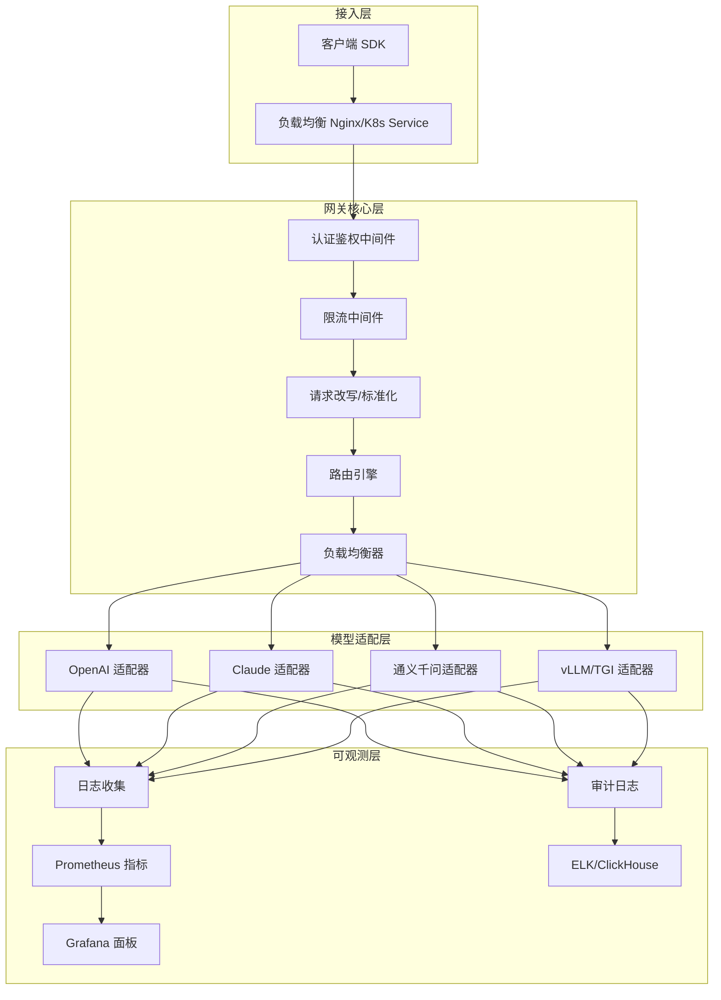
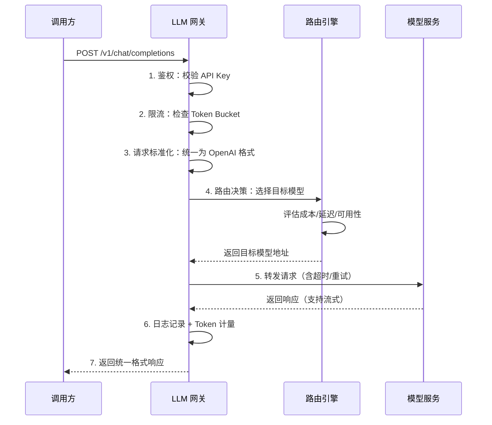
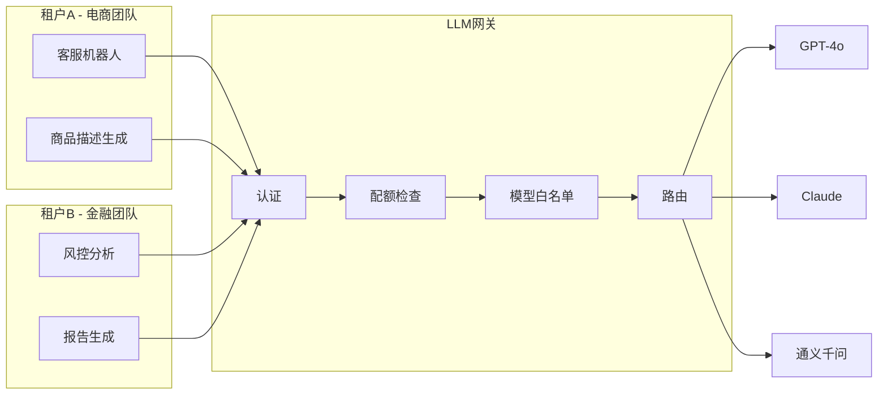
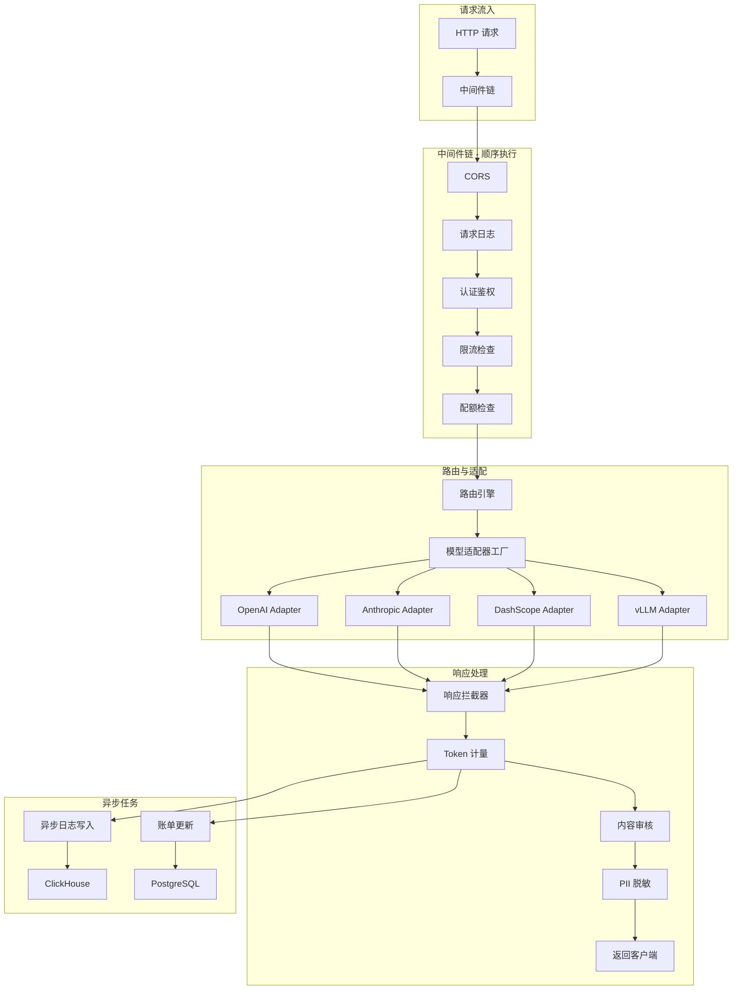

# 44 LLM网关架构设计

## 大纲

本文围绕 LLM 网关（LLM Gateway）的架构设计展开深度讲解。从"为什么需要网关"这一根本问题出发，逐步拆解网关的核心架构、开源方案 LiteLLM Proxy 的实战部署、多模型路由与负载均衡策略、多租户隔离机制，以及自建网关的完整 FastAPI 实现。最后附上面试高频追问与快速回答模板，帮助候选人在大模型工程师面试中快速组织高质量答案。

**核心知识点：**

| 主题 | 关键内容 |
|------|---------|
| 统一网关价值 | 统一鉴权、限流、日志、计费、模型抽象 |
| LiteLLM Proxy | 100+ 模型统一接口、OpenAI 兼容、配置热更新 |
| 路由策略 | 轮询、加权轮询、故障转移、成本优先、延迟感知 |
| 负载均衡 | 加权轮询、最少连接、一致性哈希 |
| 多租户隔离 | API Key 级隔离、配额管理、数据隔离 |
| 自建网关 | FastAPI + 拦截器链 + 插件化架构 |
| 生产踩坑 | 超时处理、重试幂等、流式中断恢复 |

---

## 一、为什么需要 LLM 网关

### 1.1 没有网关时的痛点

当企业内部有多个业务线接入多种大模型（OpenAI、Claude、通义千问、文心一言、自部署开源模型）时，如果没有统一的网关层，会出现以下典型问题：

1. **API Key 满天飞**：每个业务线各自申请 Key，散落在代码、配置文件、环境变量中，无法统一管理与轮换。
2. **重复造轮子**：每个项目都要实现限流、重试、日志记录、错误处理等相同逻辑。
3. **成本黑洞**：无法统计各业务线的 Token 消耗与费用，月底账单无法溯源。
4. **模型切换困难**：从 OpenAI 切换到自部署模型需要改代码，供应商锁定严重。
5. **安全与合规**：缺乏统一的 PII 过滤、内容审核、审计日志。

### 1.2 LLM 网关的核心价值

LLM 网关本质上是一个 **API 反向代理层**，位于调用方和模型服务之间，提供统一入口。其核心价值可以归纳为五个维度：

```
                ┌─────────────────────────────────┐
                │         LLM Gateway             │
                │                                  │
  调用方 ───►  │  鉴权 → 限流 → 路由 → 日志/计费  │ ───► 模型服务
                │                                  │
                └─────────────────────────────────┘
```

| 价值维度 | 具体能力 |
|---------|---------|
| 统一鉴权 | 所有调用方使用网关签发的 Key，模型 Key 集中管理 |
| 限流保护 | 按租户、按模型、按接口粒度限流，防止单租户打满配额 |
| 智能路由 | 根据成本、延迟、可用性自动选择最优模型 |
| 日志与计费 | 记录每次请求的 Token 数、延迟、成本，支持账单分摊 |
| 模型抽象 | 调用方只感知 OpenAI 兼容接口，底层模型可随时替换 |

### 1.3 网关与代理的区别

> **注意**
> LLM 网关不等同于简单的 HTTP 反向代理（如 Nginx）。Nginx 只做流量转发，不理解 LLM 请求的语义（Token 数、模型名、流式响应等）。LLM 网关需要深度理解请求内容，在应用层做路由决策、Token 计量、内容过滤等。

| 对比项 | HTTP 反向代理 | LLM 网关 |
|-------|-------------|---------|
| 协议理解 | HTTP 头部 | 理解 OpenAI/Anthropic 等协议语义 |
| 路由维度 | URL 路径、Header | 模型名、Token 数、内容类型 |
| 计费能力 | 无 | Token 级精确计费 |
| 重试逻辑 | 通用重试 | 理解 Rate Limit 响应，智能等待与降级 |
| 内容安全 | 无 | PII 过滤、敏感词审核 |

### 1.4 网关在整体技术架构中的位置

在典型的 AI 应用架构中，LLM 网关处于应用层和模型服务层之间，起到"承上启下"的关键作用。向上它为业务应用提供统一的 OpenAI 兼容接口，向下它对接各种异构的模型服务。这种分层解耦的设计使得业务方不需要关心底层模型的变化，模型团队也可以独立优化推理服务而不影响上层业务。

从实际企业落地经验来看，引入 LLM 网关之后可以带来以下几个显著的工程收益：第一是接入效率提升，新业务接入大模型能力的周期从一周缩短到一天；第二是故障定位效率提升，所有请求经过统一入口，日志和链路追踪可以快速定位到是网关问题、模型问题还是业务调用方式问题；第三是成本治理有了数据基础，各团队的 Token 消耗量、费用趋势、热门模型分布等都可以通过网关日志聚合分析出来。

---

## 二、网关核心架构

### 2.1 分层架构

一个生产级 LLM 网关通常采用分层设计：



### 2.2 请求处理流程



### 2.3 核心组件设计

| 组件 | 职责 | 技术选型 |
|------|------|---------|
| 认证鉴权 | 验证调用方身份，解析权限 | JWT/API Key + Redis |
| 限流器 | 防止过载，保护下游 | 令牌桶 / 滑动窗口 + Redis |
| 路由引擎 | 根据策略选择目标模型 | 规则引擎 / 权重表 |
| 适配器 | 统一不同模型的 API 差异 | 策略模式 + 工厂模式 |
| 日志收集 | 异步记录请求/响应详情 | Kafka + ClickHouse |
| 计费引擎 | Token 计量与费用计算 | 实时统计 + 异步账单 |

### 2.4 请求标准化与协议适配

不同模型厂商的 API 协议存在显著差异，网关的一个核心职责是将这些差异屏蔽掉。以 Chat 类接口为例，OpenAI、Anthropic、Google Gemini 三家的请求格式各有不同：

- **OpenAI**：使用 `messages` 数组，`system` 角色的消息混在 `messages` 中，通过 `model` 字段指定模型名。
- **Anthropic**：使用独立的 `system` 字段传递系统提示词，`messages` 数组中不包含 system 角色，且有独立的 `max_tokens` 必填字段。
- **Google Gemini**：使用 `contents` 数组代替 `messages`，角色名是 `user`/`model` 而非 `user`/`assistant`，Safety Settings 是独立配置。

网关的适配器层负责将统一的内部请求格式（通常以 OpenAI 格式为基准）转换为各厂商的原生格式。这种设计使得上层业务只需按照 OpenAI SDK 的方式编写代码，切换底层模型只需修改一个 `model` 字符串参数即可。

### 2.5 网关的可观测性设计

可观测性是生产级网关不可或缺的能力。一个完善的 LLM 网关应该提供三个维度的可观测数据：

1. **指标（Metrics）**：通过 Prometheus 暴露关键指标，包括请求 QPS、Token 吞吐量、各模型延迟分布（P50/P95/P99）、错误率、限流触发次数等。Grafana 面板应按模型、租户、接口三个维度做聚合展示。
2. **日志（Logs）**：每次请求记录完整的上下文：请求 ID、租户 ID、模型名、输入 Token 数、输出 Token 数、延迟、状态码、错误信息。日志异步写入 ClickHouse 或 ELK，避免阻塞主请求链路。
3. **链路追踪（Tracing）**：通过 OpenTelemetry 注入 Trace ID，串联从客户端到网关到模型服务的完整调用链，便于定位性能瓶颈。

> **注意**
> 可观测性数据的采集必须是异步的，不能阻塞主请求链路。通常使用消息队列（如 Kafka）做缓冲，后端消费者异步写入存储。如果同步写日志，一个存储抖动就会拖慢所有请求。

---

## 三、LiteLLM Proxy 实战

### 3.1 LiteLLM 简介

[LiteLLM](https://github.com/BerriAI/litellm) 是目前最流行的开源 LLM 网关方案之一，核心特点：

- **100+ 模型统一接口**：将 OpenAI、Anthropic、Google、Azure、AWS Bedrock、Cohere、自部署模型等统一为 OpenAI 兼容 API
- **一行代码切换模型**：只需修改 `model` 参数，无需改调用代码
- **内置代理服务器**：`litellm --model gpt-4o` 即可启动生产级代理
- **完善的管理面板**：支持 Key 管理、预算控制、团队管理

LiteLLM 的设计哲学是"OpenAI 兼容作为通用协议"。它内部维护了一个模型名到具体提供商的映射表，当收到请求时根据 `model` 参数自动选择对应的 Provider 并做协议转换。例如 `model="claude-sonnet"` 会自动映射到 Anthropic Provider，将 OpenAI 格式的 `messages` 转换为 Anthropic 格式的请求。这种设计使得业务代码可以完全与具体模型解耦，只需要熟悉一套 OpenAI SDK 即可调用所有支持的模型。

LiteLLM 还支持一些高级特性：自动重试与 fallback（当主模型失败时自动切换到备选模型）、负载均衡（在多个 API Key 或多个部署之间分配请求）、预算追踪（按用户/团队统计 Token 消耗和费用）、回调集成（支持将日志发送到 Langfuse、Helicone 等可观测性平台）。

### 3.2 快速部署

**方式一：Docker 部署（推荐生产环境）**

```bash
# 创建配置文件 config.yaml
cat > config.yaml << 'EOF'
model_list:
  - model_name: gpt-4o
    litellm_params:
      model: openai/gpt-4o
      api_key: os.environ/OPENAI_API_KEY

  - model_name: claude-sonnet
    litellm_params:
      model: anthropic/claude-sonnet-4-20250514
      api_key: os.environ/ANTHROPIC_API_KEY

  - model_name: qwen-plus
    litellm_params:
      model: dashscope/qwen-plus
      api_key: os.environ/DASHSCOPE_API_KEY

  - model_name: local-llama
    litellm_params:
      model: openai/meta-llama/Llama-3-70b-chat-hf
      api_base: http://vllm-server:8000/v1
      api_key: dummy

general_settings:
  master_key: sk-your-master-key
  database_url: postgresql://user:pass@db:5432/litellm
EOF

# 启动代理
docker run -d \
  --name litellm-proxy \
  -p 4000:4000 \
  -v $(pwd)/config.yaml:/app/config.yaml \
  -e OPENAI_API_KEY=sk-xxx \
  -e ANTHROPIC_API_KEY=sk-ant-xxx \
  -e DASHSCOPE_API_KEY=sk-dash-xxx \
  ghcr.io/berriai/litellm:main-latest \
  --config /app/config.yaml
```

**方式二：Python 直接启动**

```bash
pip install litellm[proxy]
litellm --model gpt-4o --port 4000
```

### 3.3 客户端调用

代理启动后，所有调用都走 OpenAI 兼容接口：

```python
from openai import OpenAI

client = OpenAI(
    base_url="http://localhost:4000/v1",
    api_key="sk-your-gateway-key"  # 网关 Key，非模型 Key
)

# 调用 GPT-4o
response = client.chat.completions.create(
    model="gpt-4o",
    messages=[{"role": "user", "content": "你好"}]
)

# 切换到 Claude，只改 model 参数
response = client.chat.completions.create(
    model="claude-sonnet",
    messages=[{"role": "user", "content": "你好"}]
)

# 切换到自部署模型
response = client.chat.completions.create(
    model="local-llama",
    messages=[{"role": "user", "content": "你好"}]
)
```

### 3.4 多模型 fallback 配置

LiteLLM 支持配置 fallback 链，当主模型不可用时自动降级：

```yaml
model_list:
  - model_name: primary-model
    litellm_params:
      model: openai/gpt-4o
      api_key: os.environ/OPENAI_API_KEY
  - model_name: fallback-model
    litellm_params:
      model: anthropic/claude-sonnet-4-20250514
      api_key: os.environ/ANTHROPIC_API_KEY

router_settings:
  routing_strategy: simple-shuffle
  num_retries: 3
  timeout: 30
  fallbacks:
    - primary-model:
        - fallback-model
```

调用时只需传 `model="primary-model"`，网关自动处理降级：

```python
# 自动 fallback：GPT-4o 失败会自动切到 Claude
response = client.chat.completions.create(
    model="primary-model",
    messages=[{"role": "user", "content": "你好"}],
    extra_body={"fallbacks": ["fallback-model"]}
)
```

---

## 四、多模型路由与负载均衡

### 4.1 路由策略概览

路由策略决定了网关如何在多个模型实例之间分配请求：

| 策略 | 原理 | 适用场景 |
|------|------|---------|
| 轮询（Round Robin） | 依次轮流分配 | 模型能力相同，实例规格一致 |
| 加权轮询（Weighted RR） | 按权重比例分配 | 混合部署不同规格的实例 |
| 最少连接（Least Connections） | 选择当前连接数最少的实例 | 请求处理时间差异大 |
| 故障转移（Failover） | 主模型故障时切到备选 | 有明确的主备模型关系 |
| 成本优先（Cost-First） | 优先选择成本最低的模型 | 成本敏感场景 |
| 延迟感知（Latency-Aware） | 选择历史延迟最低的实例 | 对响应速度要求高 |
| 语义路由 | 根据任务类型选择模型 | 不同模型擅长不同任务 |

### 4.2 加权轮询实现

```python
import itertools
from dataclasses import dataclass, field
from typing import List


@dataclass
class ModelEndpoint:
    """模型端点"""
    name: str
    url: str
    weight: int = 1
    current_connections: int = 0
    total_requests: int = 0
    avg_latency_ms: float = 0.0
    is_healthy: bool = True


@dataclass
class WeightedRoundRobinRouter:
    """加权轮询路由器"""
    endpoints: List[ModelEndpoint] = field(default_factory=list)
    _cycle: itertools.cycle = field(default=None, repr=False)

    def __post_init__(self):
        self._build_cycle()

    def _build_cycle(self):
        """根据权重构建轮询序列"""
        weighted_list = []
        for ep in self.endpoints:
            if ep.is_healthy:
                weighted_list.extend([ep] * ep.weight)
        self._cycle = itertools.cycle(weighted_list)

    def select(self) -> ModelEndpoint:
        """选择下一个端点"""
        return next(self._cycle)

    def mark_unhealthy(self, endpoint: ModelEndpoint):
        """标记端点不健康"""
        endpoint.is_healthy = False
        self._build_cycle()

    def mark_healthy(self, endpoint: ModelEndpoint):
        """恢复端点"""
        endpoint.is_healthy = True
        self._build_cycle()


# 使用示例
router = WeightedRoundRobinRouter(endpoints=[
    ModelEndpoint(name="gpt-4o", url="https://api.openai.com", weight=3),
    ModelEndpoint(name="claude-sonnet", url="https://api.anthropic.com", weight=2),
    ModelEndpoint(name="qwen-plus", url="https://dashscope.aliyuncs.com", weight=1),
])

# 按权重 3:2:1 分配请求
for _ in range(6):
    ep = router.select()
    print(f"路由到: {ep.name}")
# 输出: gpt-4o, gpt-4o, gpt-4o, claude-sonnet, claude-sonnet, qwen-plus
```

### 4.3 延迟感知路由

```python
import time
from typing import Optional
from contextlib import contextmanager


class LatencyAwareRouter:
    """延迟感知路由器 - 使用指数移动平均"""

    def __init__(self, endpoints: List[ModelEndpoint], alpha: float = 0.3):
        self.endpoints = endpoints
        self.alpha = alpha  # EMA 平滑系数

    def select(self) -> ModelEndpoint:
        """选择延迟最低的健康端点"""
        healthy = [ep for ep in self.endpoints if ep.is_healthy]
        if not healthy:
            raise RuntimeError("没有可用的健康端点")
        return min(healthy, key=lambda ep: ep.avg_latency_ms)

    def update_latency(self, endpoint: ModelEndpoint, latency_ms: float):
        """使用指数移动平均更新延迟"""
        if endpoint.avg_latency_ms == 0:
            endpoint.avg_latency_ms = latency_ms
        else:
            endpoint.avg_latency_ms = (
                self.alpha * latency_ms
                + (1 - self.alpha) * endpoint.avg_latency_ms
            )

    @contextmanager
    def track_latency(self, endpoint: ModelEndpoint):
        """上下文管理器：自动追踪请求延迟"""
        start = time.monotonic()
        try:
            yield
        finally:
            elapsed_ms = (time.monotonic() - start) * 1000
            self.update_latency(endpoint, elapsed_ms)


# 使用示例
router = LatencyAwareRouter(endpoints=[
    ModelEndpoint(name="gpt-4o", url="...", avg_latency_ms=200),
    ModelEndpoint(name="claude-sonnet", url="...", avg_latency_ms=150),
    ModelEndpoint(name="qwen-plus", url="...", avg_latency_ms=100),
])

ep = router.select()  # 选择 qwen-plus（延迟最低）
print(f"路由到: {ep.name}, 预期延迟: {ep.avg_latency_ms}ms")
```

### 4.4 成本优先路由

在实际企业应用中，成本控制是选择大模型时最重要的考量因素之一。不同模型的价格差异巨大：以 GPT-4o 为例，其输入价格约为每百万 Token 2.5 美元，输出约为 10 美元；而 GPT-4o-mini 输入仅 0.15 美元，输出 0.6 美元，差距接近 17 倍。对于大量不需要顶级推理能力的简单任务（如文本分类、情感分析、简单问答），使用低成本模型可以大幅节省开支。

成本优先路由的核心思路是：根据请求的预估 Token 数和模型单价，选择总成本最低的模型。但需要注意的是，便宜的模型可能在复杂任务上输出质量不够好，导致需要多次调用才能得到满意结果，反而增加了总成本。因此生产环境中通常会结合**任务复杂度评估**来做路由：简单任务走低成本模型，复杂任务走高成本模型。

```python
from dataclasses import dataclass


@dataclass
class ModelCost:
    model_name: str
    input_cost_per_1k: float   # 每千 Token 输入价格（元）
    output_cost_per_1k: float  # 每千 Token 输出价格（元）


class CostAwareRouter:
    """成本优先路由器"""

    def __init__(self, endpoints: List[ModelEndpoint], costs: dict):
        """
        costs: {endpoint_name: ModelCost}
        """
        self.endpoints = endpoints
        self.costs = costs

    def select(self, estimated_input_tokens: int = 500,
               estimated_output_tokens: int = 500) -> ModelEndpoint:
        """选择预估成本最低的端点"""
        healthy = [ep for ep in self.endpoints if ep.is_healthy]
        if not healthy:
            raise RuntimeError("没有可用的健康端点")

        def estimate_cost(ep: ModelEndpoint) -> float:
            cost = self.costs.get(ep.name)
            if not cost:
                return float('inf')
            input_cost = (estimated_input_tokens / 1000) * cost.input_cost_per_1k
            output_cost = (estimated_output_tokens / 1000) * cost.output_cost_per_1k
            return input_cost + output_cost

        return min(healthy, key=estimate_cost)
```

### 4.5 语义路由

语义路由是一种更高级的路由策略，它不根据静态配置做决策，而是根据请求内容的语义来选择最合适的模型。例如：

- 简单的问候或闲聊请求 → 路由到轻量级模型（成本最低）
- 包含代码相关的请求 → 路由到擅长代码的模型
- 需要长文本理解和推理的请求 → 路由到上下文窗口大且推理能力强的模型
- 涉及中文古诗词或文化的内容 → 路由到中文能力更强的模型

实现语义路由的关键是一个**任务分类器**。这个分类器可以是一个轻量级的文本分类模型（如 BERT 微调版），也可以是一个简单的规则引擎（基于关键词匹配和正则表达式）。在延迟敏感的场景下，分类器本身的推理时间不能太长，通常要求在 10 毫秒以内完成分类决策。此外，语义路由的准确率直接影响用户体验和成本效率，因此分类器需要在实际流量上持续监控准确率并定期迭代优化。

---

## 五、多租户隔离

### 5.1 隔离模型

在企业场景中，网关需要为不同团队/业务线提供隔离：



| 隔离维度 | 实现方式 |
|---------|---------|
| 身份隔离 | 每个租户独立 API Key，Key 中编码租户 ID |
| 配额隔离 | 按租户设置 RPM/TPM 限制和月度预算 |
| 模型白名单 | 租户只能访问授权的模型列表 |
| 数据隔离 | 请求日志按租户分区存储，互不可见 |
| 网络隔离 | 高安全场景下，不同租户使用独立网关实例 |

### 5.2 配额管理的最佳实践

在多租户场景下，配额管理是网关最核心的能力之一。一个设计良好的配额系统应该支持多维度、多层次的限制：

- **请求维度**：RPM（每分钟请求数）限制，防止单个租户的突发流量打满整网关的连接池。滑动窗口算法比固定窗口更平滑，避免窗口边界处的突发问题。
- **Token 维度**：TPM（每分钟 Token 数）限制，这是 LLM 场景特有的限流维度。因为不同请求的 Token 消耗差异巨大（简单问答可能 100 Token，长文档分析可能 10000 Token），仅按请求数限流不够精确。
- **预算维度**：月度预算上限，防止意外的大额支出。当预算消耗达到 80% 时触发预警通知，达到 100% 时自动拒绝新请求。
- **并发维度**：同时进行中的请求数上限，防止流式请求长时间占用连接。

配额数据需要持久化到 Redis 中，保证在网关重启后不丢失。同时建议使用 Lua 脚本实现"检查并扣减"的原子操作，避免并发场景下的竞态条件。

### 5.3 API Key 与配额管理

```python
import hashlib
import secrets
import time
from dataclasses import dataclass, field
from typing import Dict, Optional
import redis


@dataclass
class TenantConfig:
    """租户配置"""
    tenant_id: str
    name: str
    api_key_hash: str
    allowed_models: list  # 模型白名单
    rpm_limit: int = 60   # 每分钟请求数限制
    tpm_limit: int = 60000  # 每分钟 Token 数限制
    monthly_budget: float = 1000.0  # 月度预算（元）
    current_month_cost: float = 0.0


class TenantManager:
    """租户管理器"""

    def __init__(self, redis_client: redis.Redis):
        self.redis = redis_client
        self.tenants: Dict[str, TenantConfig] = {}

    def create_tenant(self, name: str, allowed_models: list,
                      rpm_limit: int = 60, monthly_budget: float = 1000.0) -> str:
        """创建租户，返回 API Key"""
        api_key = f"sk-{secrets.token_hex(32)}"
        key_hash = hashlib.sha256(api_key.encode()).hexdigest()
        tenant_id = f"tenant_{secrets.token_hex(8)}"

        tenant = TenantConfig(
            tenant_id=tenant_id,
            name=name,
            api_key_hash=key_hash,
            allowed_models=allowed_models,
            rpm_limit=rpm_limit,
            monthly_budget=monthly_budget,
        )
        self.tenants[tenant_id] = tenant
        return api_key

    def authenticate(self, api_key: str) -> Optional[TenantConfig]:
        """验证 API Key 并返回租户配置"""
        key_hash = hashlib.sha256(api_key.encode()).hexdigest()
        for tenant in self.tenants.values():
            if tenant.api_key_hash == key_hash:
                return tenant
        return None

    def check_rate_limit(self, tenant: TenantConfig) -> bool:
        """检查是否超出速率限制"""
        key = f"rate_limit:{tenant.tenant_id}:rpm"
        current = self.redis.incr(key)
        if current == 1:
            self.redis.expire(key, 60)
        return current <= tenant.rpm_limit

    def check_budget(self, tenant: TenantConfig, estimated_cost: float) -> bool:
        """检查是否超出月度预算"""
        return tenant.current_month_cost + estimated_cost <= tenant.monthly_budget

    def record_usage(self, tenant: TenantConfig, cost: float, tokens: int):
        """记录使用量"""
        tenant.current_month_cost += cost
        # 同步到 Redis 用于实时配额检查
        self.redis.hincrbyfloat(f"usage:{tenant.tenant_id}", "cost", cost)
        self.redis.hincrby(f"usage:{tenant.tenant_id}", "tokens", tokens)
```

### 5.4 基于中间件的鉴权

```python
from fastapi import Request, HTTPException
from starlette.middleware.base import BaseHTTPMiddleware


class TenantAuthMiddleware(BaseHTTPMiddleware):
    """租户鉴权中间件"""

    def __init__(self, app, tenant_manager: TenantManager):
        super().__init__(app)
        self.tenant_manager = tenant_manager

    async def dispatch(self, request: Request, call_next):
        # 跳过健康检查等公开端点
        if request.url.path in ("/health", "/docs", "/openapi.json"):
            return await call_next(request)

        # 提取 API Key
        auth_header = request.headers.get("Authorization", "")
        if not auth_header.startswith("Bearer "):
            raise HTTPException(status_code=401, detail="缺少 Authorization 头")

        api_key = auth_header[7:]
        tenant = self.tenant_manager.authenticate(api_key)
        if not tenant:
            raise HTTPException(status_code=401, detail="无效的 API Key")

        # 检查速率限制
        if not self.tenant_manager.check_rate_limit(tenant):
            raise HTTPException(
                status_code=429,
                detail=f"超出速率限制: {tenant.rpm_limit} RPM"
            )

        # 将租户信息注入请求上下文
        request.state.tenant = tenant
        response = await call_next(request)
        return response
```

---

## 六、自建网关设计

### 6.1 整体架构

当开源方案不能完全满足需求时（如需要深度定制计费逻辑、与内部系统集成），可以自建网关。以下是基于 FastAPI 的完整实现：



### 6.2 核心代码实现

#### 6.2.1 项目结构

```
llm-gateway/
├── app/
│   ├── __init__.py
│   ├── main.py              # FastAPI 入口
│   ├── config.py             # 配置管理
│   ├── middleware/
│   │   ├── auth.py           # 鉴权中间件
│   │   ├── rate_limiter.py   # 限流中间件
│   │   └── logging.py        # 日志中间件
│   ├── router/
│   │   ├── engine.py         # 路由引擎
│   │   └── strategies.py     # 路由策略
│   ├── adapters/
│   │   ├── base.py           # 适配器基类
│   │   ├── openai.py         # OpenAI 适配器
│   │   ├── anthropic.py      # Anthropic 适配器
│   │   └── dashscope.py      # 通义千问适配器
│   ├── interceptors/
│   │   ├── base.py           # 拦截器基类
│   │   ├── token_counter.py  # Token 计量
│   │   ├── content_filter.py # 内容审核
│   │   └── pii_masker.py     # PII 脱敏
│   └── models/
│       ├── tenant.py         # 租户模型
│       └── usage.py          # 用量模型
├── config.yaml
├── Dockerfile
└── requirements.txt
```

#### 6.2.2 适配器模式（核心抽象）

```python
from abc import ABC, abstractmethod
from dataclasses import dataclass
from typing import AsyncIterator, Optional
import httpx


@dataclass
class LLMRequest:
    """统一请求格式"""
    model: str
    messages: list
    temperature: float = 0.7
    max_tokens: Optional[int] = None
    stream: bool = False
    extra_params: dict = None

    def __post_init__(self):
        if self.extra_params is None:
            self.extra_params = {}


@dataclass
class LLMResponse:
    """统一响应格式"""
    model: str
    content: str
    input_tokens: int
    output_tokens: int
    finish_reason: str
    latency_ms: float
    raw_response: dict = None


class BaseLLMAdapter(ABC):
    """模型适配器基类"""

    def __init__(self, api_key: str, base_url: str = None):
        self.api_key = api_key
        self.base_url = base_url
        self.client = httpx.AsyncClient(timeout=60.0)

    @abstractmethod
    async def chat(self, request: LLMRequest) -> LLMResponse:
        """同步调用"""
        ...

    @abstractmethod
    async def chat_stream(self, request: LLMRequest) -> AsyncIterator[str]:
        """流式调用"""
        ...

    async def close(self):
        await self.client.aclose()


class OpenAIAdapter(BaseLLMAdapter):
    """OpenAI 适配器"""

    def __init__(self, api_key: str, base_url: str = "https://api.openai.com/v1"):
        super().__init__(api_key, base_url)

    async def chat(self, request: LLMRequest) -> LLMResponse:
        import time
        start = time.monotonic()

        payload = {
            "model": request.model,
            "messages": request.messages,
            "temperature": request.temperature,
            "stream": False,
        }
        if request.max_tokens:
            payload["max_tokens"] = request.max_tokens
        payload.update(request.extra_params)

        response = await self.client.post(
            f"{self.base_url}/chat/completions",
            json=payload,
            headers={"Authorization": f"Bearer {self.api_key}"}
        )
        response.raise_for_status()
        data = response.json()

        elapsed_ms = (time.monotonic() - start) * 1000
        usage = data.get("usage", {})

        return LLMResponse(
            model=data["model"],
            content=data["choices"][0]["message"]["content"],
            input_tokens=usage.get("prompt_tokens", 0),
            output_tokens=usage.get("completion_tokens", 0),
            finish_reason=data["choices"][0].get("finish_reason", "stop"),
            latency_ms=elapsed_ms,
            raw_response=data,
        )

    async def chat_stream(self, request: LLMRequest) -> AsyncIterator[str]:
        payload = {
            "model": request.model,
            "messages": request.messages,
            "temperature": request.temperature,
            "stream": True,
        }
        if request.max_tokens:
            payload["max_tokens"] = request.max_tokens

        async with self.client.stream(
            "POST",
            f"{self.base_url}/chat/completions",
            json=payload,
            headers={"Authorization": f"Bearer {self.api_key}"},
        ) as response:
            response.raise_for_status()
            async for line in response.aiter_lines():
                if line.startswith("data: ") and line != "data: [DONE]":
                    yield line[6:]


class DashScopeAdapter(BaseLLMAdapter):
    """通义千问（DashScope）适配器"""

    def __init__(self, api_key: str):
        super().__init__(
            api_key=api_key,
            base_url="https://dashscope.aliyuncs.com/compatible-mode/v1"
        )

    async def chat(self, request: LLMRequest) -> LLMResponse:
        # DashScope 兼容 OpenAI 格式，直接复用
        openai_adapter = OpenAIAdapter(self.api_key, self.base_url)
        return await openai_adapter.chat(request)

    async def chat_stream(self, request: LLMRequest) -> AsyncIterator[str]:
        openai_adapter = OpenAIAdapter(self.api_key, self.base_url)
        async for chunk in openai_adapter.chat_stream(request):
            yield chunk
```

#### 6.2.3 拦截器链模式

```python
from abc import ABC, abstractmethod
from typing import Any


class Interceptor(ABC):
    """拦截器基类"""

    @abstractmethod
    async def on_request(self, request: LLMRequest, context: dict) -> LLMRequest:
        """请求前拦截：可以修改请求"""
        return request

    @abstractmethod
    async def on_response(self, response: LLMResponse, context: dict) -> LLMResponse:
        """响应后拦截：可以修改响应或做后处理"""
        return response


class TokenCountingInterceptor(Interceptor):
    """Token 计量拦截器"""

    def __init__(self, usage_store):
        self.usage_store = usage_store

    async def on_request(self, request: LLMRequest, context: dict) -> LLMRequest:
        return request

    async def on_response(self, response: LLMResponse, context: dict) -> LLMResponse:
        tenant_id = context.get("tenant_id")
        if tenant_id:
            await self.usage_store.record(
                tenant_id=tenant_id,
                model=response.model,
                input_tokens=response.input_tokens,
                output_tokens=response.output_tokens,
            )
        return response


class ContentFilterInterceptor(Interceptor):
    """内容审核拦截器"""

    SENSITIVE_KEYWORDS = {"暴力", "色情", "赌博", "毒品"}

    async def on_request(self, request: LLMRequest, context: dict) -> LLMRequest:
        # 检查输入内容
        for msg in request.messages:
            content = msg.get("content", "")
            for keyword in self.SENSITIVE_KEYWORDS:
                if keyword in content:
                    raise ValueError(f"输入包含敏感词: {keyword}")
        return request

    async def on_response(self, response: LLMResponse, context: dict) -> LLMResponse:
        # 检查输出内容
        for keyword in self.SENSITIVE_KEYWORDS:
            if keyword in response.content:
                response.content = "[内容已过滤]"
                break
        return response


class PIIMaskingInterceptor(Interceptor):
    """PII 脱敏拦截器"""

    import re
    PHONE_PATTERN = re.compile(r'1[3-9]\d{9}')
    ID_CARD_PATTERN = re.compile(r'\d{17}[\dXx]')

    async def on_request(self, request: LLMRequest, context: dict) -> LLMRequest:
        return request

    async def on_response(self, response: LLMResponse, context: dict) -> LLMResponse:
        response.content = self.PHONE_PATTERN.sub("***手机号***", response.content)
        response.content = self.ID_CARD_PATTERN.sub("***身份证号***", response.content)
        return response


class InterceptorChain:
    """拦截器链"""

    def __init__(self):
        self.interceptors: list[Interceptor] = []

    def add(self, interceptor: Interceptor):
        self.interceptors.append(interceptor)
        return self

    async def execute_request(self, request: LLMRequest, context: dict) -> LLMRequest:
        for interceptor in self.interceptors:
            request = await interceptor.on_request(request, context)
        return request

    async def execute_response(self, response: LLMResponse, context: dict) -> LLMResponse:
        # 响应拦截器反序执行（类似洋葱模型）
        for interceptor in reversed(self.interceptors):
            response = await interceptor.on_response(response, context)
        return response
```

#### 6.2.4 FastAPI 主入口

```python
from fastapi import FastAPI, Request, HTTPException
from fastapi.responses import StreamingResponse, JSONResponse
from pydantic import BaseModel
from typing import List, Optional
import json
import time

app = FastAPI(title="LLM Gateway", version="1.0.0")

# 全局组件（实际项目中用依赖注入）
# tenant_manager = TenantManager(redis_client)
# router_engine = RouterEngine()
# interceptor_chain = InterceptorChain()


class ChatMessage(BaseModel):
    role: str
    content: str


class ChatCompletionRequest(BaseModel):
    model: str
    messages: List[ChatMessage]
    temperature: Optional[float] = 0.7
    max_tokens: Optional[int] = None
    stream: Optional[bool] = False


@app.post("/v1/chat/completions")
async def chat_completions(
    body: ChatCompletionRequest,
    request: Request,
):
    """统一聊天接口 - 兼容 OpenAI 格式"""
    tenant = request.state.tenant  # 由鉴权中间件注入

    # 检查模型白名单
    if body.model not in tenant.allowed_models:
        raise HTTPException(
            status_code=403,
            detail=f"租户无权访问模型: {body.model}"
        )

    # 构建统一请求
    llm_request = LLMRequest(
        model=body.model,
        messages=[m.model_dump() for m in body.messages],
        temperature=body.temperature,
        max_tokens=body.max_tokens,
        stream=body.stream,
    )

    context = {"tenant_id": tenant.tenant_id, "request_id": request.headers.get("X-Request-ID")}

    # 执行请求拦截器链
    llm_request = await interceptor_chain.execute_request(llm_request, context)

    # 路由选择
    endpoint = router_engine.select(llm_request.model)
    adapter = adapter_factory.get_adapter(endpoint)

    if body.stream:
        # 流式响应
        async def generate():
            async for chunk in adapter.chat_stream(llm_request):
                yield f"data: {chunk}\n\n"
            yield "data: [DONE]\n\n"

        return StreamingResponse(generate(), media_type="text/event-stream")
    else:
        # 同步响应
        llm_response = await adapter.chat(llm_request)

        # 执行响应拦截器链
        llm_response = await interceptor_chain.execute_response(llm_response, context)

        # 返回 OpenAI 格式响应
        return JSONResponse({
            "id": f"chatcmpl-{int(time.time())}",
            "object": "chat.completion",
            "model": llm_response.model,
            "choices": [{
                "index": 0,
                "message": {
                    "role": "assistant",
                    "content": llm_response.content,
                },
                "finish_reason": llm_response.finish_reason,
            }],
            "usage": {
                "prompt_tokens": llm_response.input_tokens,
                "completion_tokens": llm_response.output_tokens,
                "total_tokens": llm_response.input_tokens + llm_response.output_tokens,
            },
        })


@app.get("/health")
async def health_check():
    return {"status": "ok", "timestamp": time.time()}


@app.get("/v1/models")
async def list_models(request: Request):
    """列出当前租户可用的模型"""
    tenant = request.state.tenant
    return {
        "object": "list",
        "data": [{"id": m, "object": "model"} for m in tenant.allowed_models]
    }
```

### 6.3 插件化配置管理

```python
import yaml
from pathlib import Path


def load_config(config_path: str = "config.yaml") -> dict:
    """加载配置文件"""
    with open(config_path) as f:
        config = yaml.safe_load(f)
    return config


# config.yaml 示例
"""
gateway:
  host: 0.0.0.0
  port: 4000
  workers: 4

models:
  - name: gpt-4o
    adapter: openai
    api_key: ${OPENAI_API_KEY}
    base_url: https://api.openai.com/v1
    weight: 3
    max_rpm: 500

  - name: claude-sonnet
    adapter: anthropic
    api_key: ${ANTHROPIC_API_KEY}
    weight: 2
    max_rpm: 300

  - name: qwen-plus
    adapter: dashscope
    api_key: ${DASHSCOPE_API_KEY}
    weight: 1
    max_rpm: 1000

routing:
  strategy: weighted-round-robin  # weighted-rr | latency-aware | cost-first | failover
  fallback_chain:
    - gpt-4o
    - claude-sonnet
    - qwen-plus

rate_limiting:
  default_rpm: 60
  default_tpm: 60000

interceptors:
  - type: content_filter
    enabled: true
  - type: pii_masking
    enabled: true
  - type: token_counting
    enabled: true

tenants:
  - id: team-a
    name: 电商团队
    allowed_models: [gpt-4o, qwen-plus]
    rpm_limit: 120
    monthly_budget: 5000
"""
```

### 6.4 生产踩坑与解决方案

在实际生产环境中部署 LLM 网关，会遇到各种工程问题。以下是几个最常见的坑以及经过验证的解决方案：

**踩坑一：超时处理不当导致连接泄漏**

问题现象：网关向模型服务发起请求后，如果模型服务长时间不响应（比如大模型推理卡死），网关的连接会一直被占用，最终耗尽连接池，导致后续所有请求都失败。

解决方案：必须设置多层超时。连接超时（connect timeout）设为 5 秒，确保快速发现不可达的服务。读取超时（read timeout）根据模型类型分别设置：快速模型设 30 秒，复杂推理模型设 120 秒。总请求超时（total timeout）设为 300 秒，超过直接返回 504 给客户端。同时在连接池层面设置最大连接数和最大待处理请求数，防止连接池被打满。

**踩坑二：重试导致雪崩**

问题现象：某个模型服务出现问题时，网关自动重试会放大请求量，加剧下游压力，形成正反馈回路导致雪崩。

解决方案：引入熔断器（Circuit Breaker）模式。当某个模型的连续失败次数超过阈值（如 5 次），熔断器打开，后续请求直接走 fallback 模型，不再尝试故障模型。每隔一段时间（如 30 秒）进入半开状态，放一个探测请求测试恢复情况。这个模式可以有效防止故障扩散。

**踩坑三：流式请求中断后无法恢复**

问题现象：流式传输过程中模型服务断开连接，客户端收到不完整的响应，无法继续使用。

解决方案：网关在流式传输过程中维护一个响应缓冲区，累积已发送的内容。当中断发生时，网关可以自动切换到备选模型，将已累积的内容作为前缀，让备选模型继续生成。但这种"续写"方案实现复杂且效果不一定好。更常见的做法是在流的最后一帧发送错误信息，告知客户端需要重新发起完整请求。

**踩坑四：并发请求下的竞态条件**

问题现象：多个并发请求同时检查和更新限流计数器或配额余额，导致超发（实际请求数超过限制）。

解决方案：使用 Redis 的原子操作或 Lua 脚本实现"检查并扣减"的原子语义。例如使用 `DECR` 命令原子地减少剩余配额，如果返回值小于 0 则拒绝请求并用 `INCR` 回退。或者使用 Redis 的 `WATCH/MULTI/EXEC` 事务机制。在 Python 中也可以使用 `redis-py` 的 `pipeline` 实现批量原子操作。

**踩坑五：API Key 轮换导致服务中断**

问题现象：模型服务商的 API Key 需要定期轮换，但在更新 Key 的瞬间如果有正在处理的请求会因为 Key 失效而报错。

解决方案：支持每个模型配置多个 API Key，网关自动在 Key 之间轮转。当某个 Key 收到 401 响应时，自动将其标记为失效并切换到下一个 Key，同时触发告警通知运维人员更新。配置更新通过配置中心热推送，不需要重启网关服务。

---

## 七、面试高频追问

### Q1: LLM 网关和传统的 API 网关（如 Kong、APISIX）有什么区别？为什么不直接用它们？

**答：** 传统 API 网关（Kong、APISIX、Spring Cloud Gateway）主要面向 RESTful/GraphQL API 设计，关注的是 URL 路径路由、Header 过滤、通用限流等。LLM 网关的核心差异在于：

1. **语义理解不同**：LLM 网关需要理解请求中的 `model` 字段、`messages` 结构、`stream` 标记等，而非简单的 URL 路径匹配。
2. **计量维度不同**：传统网关按请求数/QPS 计量，LLM 网关需要按 Token 数计量（input_tokens / output_tokens 分别统计），这是计费的基础。
3. **流式响应处理**：LLM 场景大量使用 SSE（Server-Sent Events）流式传输，网关需要能正确透传流式数据并在过程中计量 Token。
4. **模型适配层**：不同模型厂商的 API 差异显著（如 Anthropic 的消息格式、system prompt 的处理方式），需要专门的适配器层做协议转换。
5. **智能路由**：路由决策需要考虑模型能力（擅长代码还是文学）、成本（每千 Token 价格差异可达 10 倍）、延迟等因素，比传统 URL 路由复杂得多。

当然，可以在传统网关之上再加一层 LLM 语义网关，两者配合使用：Kong/APISIX 负责流量管理、SSL、WAF 等基础设施层能力，LLM 网关负责应用层的模型路由和 Token 计量。

### Q2: 如何处理 LLM 网关的流式响应？流式场景下怎么做 Token 计量和内容审核？

**答：** 流式响应是 LLM 网关的核心难点之一。处理策略如下：

1. **Token 计量**：流式场景下，服务端不会一次性返回 `usage` 字段。有两种方案：
   - **方案 A**：在网关侧用 tiktoken 等库实时计算。每个 SSE chunk 到达时，累积 output 文本并用 tokenizer 计算 Token 数。优点是实时性好，缺点是不同模型的 tokenizer 不同，需要维护多套。
   - **方案 B**：在流的最后一帧（部分模型如 OpenAI 在 stream_options 中设置 `include_usage: true`）会返回 usage 信息，直接解析即可。
   - **生产推荐**：方案 B 优先，方案 A 作为兜底。

2. **内容审核**：流式场景无法等全部内容返回再审核（会破坏流式体验）。通常采用：
   - **窗口缓冲法**：每累积 N 个 Token 或 M 个字符，做一次增量审核。
   - **异步审核法**：先放行流式数据，同时异步审核，发现违规时记录告警或通过独立通道通知客户端。
   - **后置拦截**：流结束后做全量审核，违规内容计入黑名单，后续不再返回该结果。

3. **流中断恢复**：如果流式传输中途模型服务断开，网关应返回一个错误帧，而非直接断开连接。格式为：`data: {"error": {"message": "上游服务中断", "type": "upstream_error"}}`。

### Q3: 网关如何实现多模型的自动 fallback？需要注意什么问题？

**答：** 自动 fallback 的核心逻辑是：当主模型请求失败（超时、5xx、限流）时，自动将相同请求转发到备选模型。实现要点：

1. **重试判断条件**：不是所有错误都应重试。只有以下情况触发 fallback：
   - HTTP 429（限流）：等待 Retry-After 后重试，或直接切模型
   - HTTP 5xx（服务端错误）：直接切模型
   - 超时：直接切模型
   - HTTP 400/401/403：不应重试，说明请求本身有问题

2. **幂等性保证**：LLM 请求天然是非幂等的（相同输入可能产生不同输出），这在重试时需要特别注意。对于非流式请求，重试到不同模型后，响应质量可能不同。应在响应中标记实际使用的模型名。

3. **上下文一致性**：Claude 和 GPT 的 system prompt 处理方式不同，fallback 时可能需要请求转换。网关的适配器层负责这个转换。

4. **避免雪崩**：fallback 链上所有模型不应有重叠的付费配额来源。如果两个模型共用同一个 API Key 且共享 Rate Limit，fallback 会加剧限流。

5. **用户感知**：在响应 header 中添加 `X-LLM-Actual-Model` 告知客户端实际使用的模型，便于调试和审计。

### Q4: 如何设计网关的高可用架构？

**答：** LLM 网关作为所有 AI 调用的入口，是关键的单点（SPOF），必须做好高可用：

1. **无状态设计**：网关本身不存储会话状态，所有状态（限流计数、用量统计）存储在 Redis 等外部存储中。这样可以水平扩展网关实例。
2. **多实例部署**：至少部署 2 个网关实例，前面挂 K8s Service 或 Nginx 做四层负载均衡。
3. **健康检查**：每个网关实例暴露 `/health` 端点，配合 K8s liveness/readiness probe，自动摘除异常实例。
4. **配置热更新**：模型配置、路由策略、限流规则等应支持热更新（通过配置中心如 Apollo/Nacos，或定期从数据库拉取），无需重启网关。
5. **降级策略**：当网关本身过载时，应能快速降级为简单代理模式（跳过审核、计费等非核心拦截器），保证基本的请求转发能力。
6. **多区域部署**：对于跨地域业务，在每个区域部署网关实例，就近接入模型服务，减少网络延迟。

### Q5: 网关如何处理大模型的长连接和超时问题？

**答：** LLM 请求有两个显著特征：请求处理时间长（数秒到数分钟）、使用大量长连接。处理策略：

1. **超时分层设置**：
   - 网关到客户端：设置较长超时（如 300s），因为用户能接受等待
   - 网关到模型服务：设置中等超时（如 60-120s），取决于模型类型。快速模型（如 GPT-4o-mini）设 30s，慢速推理模型（如 70B 开源模型）设 120s
   - 连接池超时：keep-alive 设为 60s，避免连接过早回收

2. **连接池管理**：对每个上游模型维护独立的连接池，避免连接饥饿。使用 `httpx.AsyncClient` 或 `aiohttp.TCPConnector` 配置：
   - `max_connections`：总连接数上限
   - `max_connections_per_host`：单 host 连接数上限
   - 使用 HTTP/2 多路复用减少连接数

3. **请求排队**：当连接池满时，请求进入队列等待（而非立即拒绝）。队列设上限和超时，避免无限等待。

4. **心跳保活**：对于长时间的流式请求，定期发送空的 SSE comment（`: keepalive\n\n`）防止中间代理（Nginx、ALB）断开连接。

### Q6: LiteLLM 和自建网关的优缺点对比？什么场景选哪个？

**答：**

| 维度 | LiteLLM | 自建网关 |
|------|---------|---------|
| 上手成本 | 低，YAML 配置即可 | 高，需要完整开发 |
| 模型覆盖 | 100+ 模型开箱即用 | 需逐一实现适配器 |
| 定制能力 | 中等，支持回调和插件 | 高，完全可控 |
| 企业集成 | 一般，与内部系统对接需要额外开发 | 好，可以直接对接内部中间件 |
| 计费精度 | 基础计费 | 可实现精细化计费 |
| 运维复杂度 | 低，单一进程 | 高，多组件 |
| 社区支持 | 活跃，文档完善 | 自维护 |

**选择建议**：
- **选 LiteLLM**：中小团队、快速验证、模型种类多但定制需求少
- **选自建**：大型企业、深度集成内部系统、有精细化计费需求、需要定制化内容审核
- **混合方案**：用 LiteLLM 做模型适配层，外层包一层自建网关做企业级能力（鉴权、计费、审计）

---

## 八、快速回答模板

面试中遇到 LLM 网关相关问题时，可以用以下模板快速组织回答：

### 模板 1：什么是 LLM 网关？

> LLM 网关是位于调用方和大模型服务之间的**统一代理层**，提供 **统一鉴权、智能路由、限流保护、Token 计量和日志审计** 五大核心能力。它的核心价值在于：对上层业务屏蔽模型差异（通过 OpenAI 兼容接口），对下层模型实现智能路由（基于成本、延迟、可用性），同时集中管理 API Key 和预算配额。典型开源方案有 LiteLLM Proxy，大型企业通常基于 FastAPI 自建以满足定制化需求。

### 模板 2：如何实现多模型路由？

> 多模型路由的核心是**路由策略引擎**。常见策略包括：加权轮询（按权重比例分配）、最少连接（选当前负载最低的实例）、延迟感知（基于历史延迟的指数移动平均选择最快实例）、成本优先（根据预估 Token 数计算费用选择最便宜的模型）。生产环境通常还会配置 **fallback 链**：主模型失败时（限流/超时/5xx），自动降级到备选模型。实现上用策略模式，每种路由策略实现一个 `select()` 方法，通过配置热切换。

### 模板 3：网关如何做流式 Token 计量？

> 有两种方案。**方案 A（精确计量）**：要求模型服务在流的最后一帧返回 usage 字段（如 OpenAI 的 `stream_options.include_usage=true`），直接解析即可，准确且无额外开销。**方案 B（网关估算）**：用 tiktoken 在网关侧实时对累积的 output 文本做 Token 计数，适用于不返回 usage 的模型。生产中推荐 A 为主、B 为兜底。同时需要在流式过程中异步写入用量数据到 Redis/ClickHouse，避免阻塞响应流。

### 模板 4：自建网关的关键设计决策？

> 自建 LLM 网关有四个关键设计决策：**（1）适配器模式**：每个模型厂商一个 Adapter，统一请求/响应格式，新增模型只需添加适配器。**（2）拦截器链**：鉴权、限流、审核、计费等能力通过拦截器链实现，请求和响应分别经过链式处理（洋葱模型）。**（3）无状态网关**：所有状态存 Redis，网关本身无状态可水平扩展。**（4）配置热更新**：通过配置中心实现模型列表、路由策略、限流规则的动态更新，无需重启服务。

### 模板 5：网关的重试和幂等性怎么处理？

> LLM 请求天然是**非幂等**的（相同输入可能产生不同输出），因此重试策略需要谨慎设计。**重试条件**：仅对 429（限流）、5xx（服务端错误）、超时进行重试，400/401/403 不重试。**重试方式**：优先在同一模型的不同实例重试（如果有多实例），再 fallback 到不同模型。**幂等性保障**：虽然 LLM 本身不幂等，但网关层面可以对同一请求 ID 返回缓存结果（可选），或在响应 header 中标记实际使用的模型和重试次数。**防雪崩**：对每个模型维护熔断器（Circuit Breaker），连续失败 N 次后短路该模型，避免无效重试放大故障。

---

**总结**：LLM 网关是企业级 AI 应用的基础设施，面试中需要掌握其核心价值（为什么需要）、架构设计（怎么做）、以及生产实践中的关键问题（流式处理、多租户、高可用）。建议结合 LiteLLM 的使用经验和自建网关的代码实践来回答，展现从开源方案到自研方案的完整技术视野。

在实际面试中，面试官通常会从"你用过什么 LLM 网关方案"切入，逐步深入到架构设计细节。建议候选人不仅要熟悉 LiteLLM 等开源方案的配置和使用，还要理解背后的架构思想：适配器模式、拦截器链、路由策略、熔断降级等。这些设计模式不仅适用于 LLM 网关，也是分布式系统设计的通用知识。最后强调一点，网关的核心价值不是做简单的转发代理，而是在请求链路上叠加企业级的治理能力，包括安全管控、成本优化、质量保障和运维可观测性。
