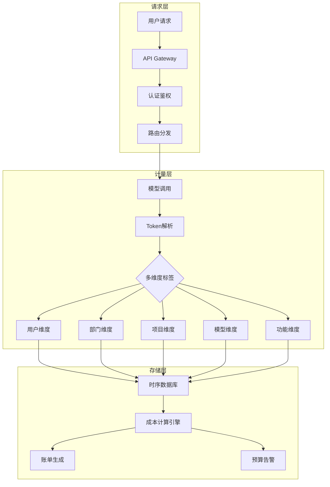
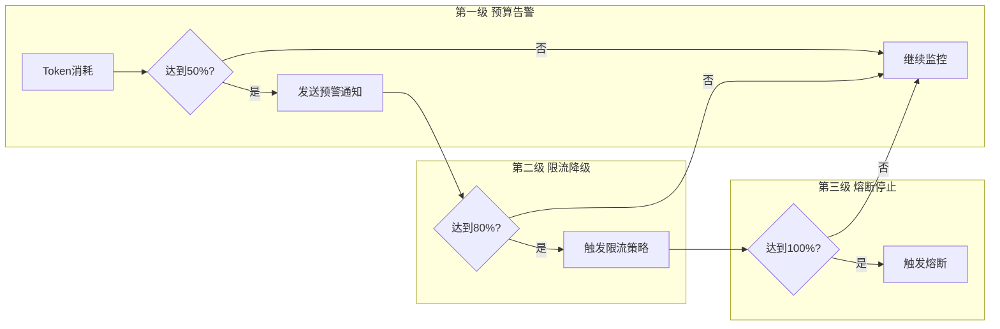
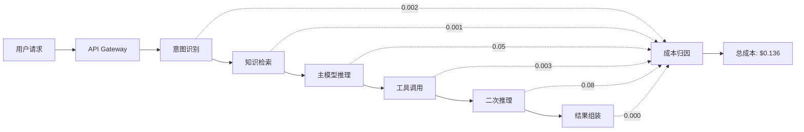

# Token计量与成本治理

## 大纲

本文系统讲解大模型网关中的Token计量与成本治理体系，涵盖以下核心内容：

- **Token计量基础**：Token计数原理、tiktoken工具链、不同模型Tokenizer差异对比
- **多维度计量体系**：按用户、部门、项目、模型等维度的精细化计量方案
- **预算告警与熔断**：阈值通知、自动熔断、降级策略的完整实现
- **成本归因与账单分摊**：请求链路追踪、成本分摊算法与透明化账单
- **成本优化实战**：Prompt压缩、缓存复用、模型降级等核心优化手段
- **Prometheus+Grafana监控**：指标体系设计、Dashboard配置与告警规则
- **面试高频追问与快速回答模板**

---

## 一、Token计量基础

### 1.1 什么是Token

Token是大语言模型处理文本的基本单元。一个Token不一定等于一个汉字或一个英文单词，它取决于Tokenizer的分词策略。通常而言：

| 语言 | Token估算 | 示例 |
|------|-----------|------|
| 英文 | 1个Token约4个字符 | "Hello world" = 2 tokens |
| 中文 | 1个汉字约1.5-2个Token | "你好世界" = 4-6 tokens |
| 代码 | 1个Token约3-4个字符 | `print("hi")` = 4 tokens |

> [!IMPORTANT]
> 不同模型使用不同的Tokenizer，同一段文本在GPT-4和Claude中产生的Token数可能相差20%-30%。在计量体系中，必须明确以哪个Tokenizer的计算结果为准。

### 1.2 tiktoken工具链

tiktoken是OpenAI开源的BPE（Byte Pair Encoding）Tokenizer实现，速度比HuggingFace的tokenizers快3-6倍：

```python
import tiktoken

# GPT-4 / GPT-3.5 使用 cl100k_base 编码
enc_gpt4 = tiktoken.encoding_for_model("gpt-4")

# GPT-4o 使用 o200k_base 编码（更高效的多语言支持）
enc_gpt4o = tiktoken.encoding_for_model("gpt-4o")

text = "大模型网关的Token计量与成本治理是一个重要课题"

tokens_gpt4 = enc_gpt4.encode(text)
tokens_gpt4o = enc_gpt4o.encode(text)

print(f"GPT-4 cl100k_base: {len(tokens_gpt4)} tokens")    # 约 22 tokens
print(f"GPT-4o o200k_base: {len(tokens_gpt4o)} tokens")   # 约 14 tokens
```

### 1.3 不同模型Tokenizer差异对比

| 模型 | Tokenizer | 词表大小 | 中文效率 | 特点 |
|------|-----------|----------|----------|------|
| GPT-3.5/4 | cl100k_base | 100,256 | 中等 | 广泛兼容，生态成熟 |
| GPT-4o | o200k_base | 200,019 | 较高 | 多语言优化，Token更少 |
| Claude 3 | Anthropic自研 | ~100K | 较高 | 与cl100k接近但不完全相同 |
| LLaMA 3 | BPE | 128,256 | 高 | 支持更多Unicode字符 |
| Qwen | tiktoken变体 | 151,643 | 很高 | 针对中文深度优化 |
| DeepSeek | tiktoken变体 | 100,015 | 高 | 中文代码混合优化 |

```python
# 各模型Token计数统一封装
import tiktoken
from transformers import AutoTokenizer

class TokenCounter:
    """统一Token计数器，适配多模型"""
    
    def __init__(self):
        self._encoders = {}
    
    def count_openai(self, text: str, model: str = "gpt-4") -> int:
        """OpenAI系列模型Token计数"""
        if model not in self._encoders:
            self._encoders[model] = tiktoken.encoding_for_model(model)
        return len(self._encoders[model].encode(text))
    
    def count_huggingface(self, text: str, model_path: str) -> int:
        """HuggingFace模型Token计数（适用于开源模型）"""
        if model_path not in self._encoders:
            self._encoders[model_path] = AutoTokenizer.from_pretrained(model_path)
        return len(self._encoders[model_path].encode(text))
    
    def count_messages(self, messages: list, model: str = "gpt-4") -> int:
        """计算消息列表的总Token数（含system prompt、格式开销）"""
        enc = tiktoken.encoding_for_model(model)
        
        # 每条消息的固定格式开销
        tokens_per_message = 3  # <|start|>{role}\n ... \n
        tokens_per_name = 1     # name字段额外开销
        
        total = 0
        for msg in messages:
            total += tokens_per_message
            for key, value in msg.items():
                total += len(enc.encode(value))
                if key == "name":
                    total += tokens_per_name
        total += 3  # 回复的 priming tokens
        return total
```

### 1.4 Token计量的三大核心指标

在成本治理中，我们需要精确计量三类Token：

- **Input Tokens（输入Token）**：用户消息 + System Prompt + 上下文
- **Output Tokens（输出Token）**：模型生成的回复内容
- **Cached Tokens（缓存Token）**：命中Prompt Cache的输入部分（仅部分模型支持）

```python
# Token用量数据结构
from dataclasses import dataclass, field
from typing import Optional
from datetime import datetime

@dataclass
class TokenUsage:
    """单次请求的Token用量记录"""
    request_id: str
    model: str
    input_tokens: int
    output_tokens: int
    cached_tokens: int = 0
    total_tokens: int = 0
    cost_usd: float = 0.0
    cost_cny: float = 0.0
    timestamp: datetime = field(default_factory=datetime.now)
    
    # 多维度标签
    user_id: Optional[str] = None
    department: Optional[str] = None
    project_id: Optional[str] = None
    api_key_id: Optional[str] = None
    
    def __post_init__(self):
        self.total_tokens = self.input_tokens + self.output_tokens
```

---

## 二、多维度计量体系

### 2.1 计量架构总览



### 2.2 多维度标签体系设计

```python
from dataclasses import dataclass, field
from typing import Dict, Optional
from enum import Enum

class CostDimension(Enum):
    USER = "user"
    DEPARTMENT = "department"
    PROJECT = "project"
    MODEL = "model"
    FEATURE = "feature"
    ENVIRONMENT = "environment"

@dataclass
class CostLabel:
    """成本标签，支持多维度聚合"""
    user_id: str
    department: str
    project_id: str
    model: str
    feature: str          # 如: chat, embedding, completion
    environment: str = "production"  # production, staging, dev
    
    def to_dict(self) -> Dict[str, str]:
        return {
            "user_id": self.user_id,
            "department": self.department,
            "project_id": self.project_id,
            "model": self.model,
            "feature": self.feature,
            "environment": self.environment,
        }
    
    def group_key(self, dimension: CostDimension) -> str:
        """获取指定维度的聚合Key"""
        return self.to_dict()[dimension.value]


# 模型定价配置
MODEL_PRICING = {
    # OpenAI 模型定价（USD per 1M tokens）
    "gpt-4o":            {"input": 2.50,  "output": 10.00, "cached_input": 1.25},
    "gpt-4o-mini":       {"input": 0.15,  "output": 0.60,  "cached_input": 0.075},
    "gpt-4-turbo":       {"input": 10.00, "output": 30.00, "cached_input": 5.00},
    "gpt-3.5-turbo":     {"input": 0.50,  "output": 1.50,  "cached_input": 0.25},
    
    # Claude 模型定价
    "claude-3.5-sonnet": {"input": 3.00,  "output": 15.00, "cached_input": 0.30},
    "claude-3-haiku":    {"input": 0.25,  "output": 1.25,  "cached_input": 0.03},
    
    # 国内模型定价
    "qwen-max":          {"input": 0.40,  "output": 1.20,  "cached_input": 0.04},
    "deepseek-chat":     {"input": 0.14,  "output": 0.28,  "cached_input": 0.014},
    "glm-4":             {"input": 0.70,  "output": 0.70,  "cached_input": None},
}

class CostCalculator:
    """成本计算器"""
    
    def __init__(self, usd_to_cny: float = 7.25):
        self.usd_to_cny = usd_to_cny
    
    def calculate(self, model: str, input_tokens: int, 
                  output_tokens: int, cached_tokens: int = 0) -> Dict[str, float]:
        """计算单次请求成本"""
        pricing = MODEL_PRICING.get(model)
        if not pricing:
            raise ValueError(f"Unknown model: {model}")
        
        # 非缓存输入Token数
        non_cached_input = input_tokens - cached_tokens
        
        # 计算USD成本（价格单位是每百万Token）
        input_cost = (non_cached_input * pricing["input"]) / 1_000_000
        cached_cost = 0.0
        if cached_tokens > 0 and pricing.get("cached_input"):
            cached_cost = (cached_tokens * pricing["cached_input"]) / 1_000_000
        output_cost = (output_tokens * pricing["output"]) / 1_000_000
        
        total_usd = input_cost + cached_cost + output_cost
        total_cny = total_usd * self.usd_to_cny
        
        return {
            "input_cost_usd": round(input_cost, 6),
            "cached_cost_usd": round(cached_cost, 6),
            "output_cost_usd": round(output_cost, 6),
            "total_cost_usd": round(total_usd, 6),
            "total_cost_cny": round(total_cny, 4),
            "savings_from_cache_usd": round(
                cached_tokens * (pricing["input"] - (pricing.get("cached_input") or 0)) / 1_000_000, 6
            ),
        }
```

### 2.3 按维度聚合查询

```python
from collections import defaultdict
from datetime import datetime, timedelta
from typing import List

class CostAggregator:
    """多维度成本聚合器"""
    
    def __init__(self):
        self.usage_records: List[TokenUsage] = []
    
    def add_record(self, record: TokenUsage):
        self.usage_records.append(record)
    
    def aggregate_by(self, dimension: str, 
                     start_time: datetime = None,
                     end_time: datetime = None) -> Dict[str, Dict]:
        """按指定维度聚合成本数据"""
        result = defaultdict(lambda: {
            "total_tokens": 0,
            "input_tokens": 0,
            "output_tokens": 0,
            "total_cost_cny": 0.0,
            "request_count": 0,
        })
        
        for record in self.usage_records:
            if start_time and record.timestamp < start_time:
                continue
            if end_time and record.timestamp > end_time:
                continue
            
            key = getattr(record, dimension, "unknown")
            result[key]["total_tokens"] += record.total_tokens
            result[key]["input_tokens"] += record.input_tokens
            result[key]["output_tokens"] += record.output_tokens
            result[key]["total_cost_cny"] += record.cost_cny
            result[key]["request_count"] += 1
        
        return dict(result)
    
    def get_top_consumers(self, dimension: str, top_n: int = 10) -> List[Dict]:
        """获取指定维度的Top N消耗者"""
        agg = self.aggregate_by(dimension)
        sorted_items = sorted(
            agg.items(), 
            key=lambda x: x[1]["total_cost_cny"], 
            reverse=True
        )
        return [
            {"label": k, **v} for k, v in sorted_items[:top_n]
        ]
```

---

## 三、预算告警与熔断

### 3.1 三级预算管控体系



| 级别 | 阈值 | 动作 | 通知方式 |
|------|------|------|----------|
| 预警 | 50% | 发送通知，记录日志 | 飞书/钉钉/邮件 |
| 限流 | 80% | 降低QPS、降级模型 | 短信 + 电话 |
| 熔断 | 100% | 拒绝所有非白名单请求 | 电话 + 人工介入 |

### 3.2 预算管理器实现

```python
import asyncio
import time
from enum import Enum
from dataclasses import dataclass, field
from typing import Dict, Optional, Callable, Awaitable
import logging

logger = logging.getLogger(__name__)

class BudgetLevel(Enum):
    NORMAL = "normal"
    WARNING = "warning"     # 50%
    THROTTLED = "throttled" # 80%
    CIRCUIT_BREAK = "circuit_break"  # 100%

@dataclass
class BudgetConfig:
    """预算配置"""
    budget_id: str
    owner_type: str           # user / department / project
    owner_id: str
    monthly_limit_usd: float  # 月度预算上限（美元）
    daily_limit_usd: Optional[float] = None
    
    # 各级阈值比例
    warning_ratio: float = 0.5
    throttle_ratio: float = 0.8
    break_ratio: float = 1.0
    
    # 白名单：熔断后仍允许的请求类型
    whitelist_features: list = field(default_factory=lambda: ["health_check"])
    
    # 降级策略
    downgrade_model: Optional[str] = None   # 降级到哪个模型
    max_tokens_per_request: int = 4096      # 限制最大输出Token

class BudgetManager:
    """预算管理器"""
    
    def __init__(self):
        self.budgets: Dict[str, BudgetConfig] = {}
        self.usage: Dict[str, float] = {}      # budget_id -> 累计消耗(USD)
        self.daily_usage: Dict[str, float] = {}
        self.alert_callbacks: list[Callable] = []
        self._lock = asyncio.Lock()
    
    def register_budget(self, config: BudgetConfig):
        self.budgets[config.budget_id] = config
        self.usage[config.budget_id] = 0.0
        self.daily_usage[config.budget_id] = 0.0
    
    async def record_usage(self, budget_id: str, cost_usd: float, 
                          feature: str = "chat") -> BudgetLevel:
        """记录消耗并返回当前预算级别"""
        async with self._lock:
            self.usage[budget_id] += cost_usd
            self.daily_usage[budget_id] += cost_usd
            
            config = self.budgets[budget_id]
            current = self.usage[budget_id]
            monthly_limit = config.monthly_limit_usd
            
            # 判断预算级别
            ratio = current / monthly_limit
            level = BudgetLevel.NORMAL
            
            if ratio >= config.break_ratio:
                level = BudgetLevel.CIRCUIT_BREAK
            elif ratio >= config.throttle_ratio:
                level = BudgetLevel.THROTTLED
            elif ratio >= config.warning_ratio:
                level = BudgetLevel.WARNING
            
            # 触发告警
            if level != BudgetLevel.NORMAL:
                await self._fire_alert(budget_id, level, ratio, current, monthly_limit)
            
            return level
    
    def check_request_allowed(self, budget_id: str, feature: str) -> tuple[bool, str]:
        """检查请求是否被允许，返回(是否允许, 原因)"""
        config = self.budgets.get(budget_id)
        if not config:
            return True, "no_budget_configured"
        
        current = self.usage.get(budget_id, 0)
        ratio = current / config.monthly_limit_usd
        
        # 日预算检查
        if config.daily_limit_usd:
            daily = self.daily_usage.get(budget_id, 0)
            if daily >= config.daily_limit_usd:
                return False, "daily_budget_exceeded"
        
        if ratio >= config.break_ratio:
            if feature in config.whitelist_features:
                return True, "whitelisted"
            return False, "monthly_budget_exceeded"
        
        if ratio >= config.throttle_ratio:
            # 限流：通过概率丢弃
            import random
            throttle_rate = (ratio - config.throttle_ratio) / (config.break_ratio - config.throttle_ratio)
            if random.random() < throttle_rate * 0.5:
                return False, "throttled"
        
        return True, "allowed"
    
    def get_downgrade_config(self, budget_id: str) -> Optional[Dict]:
        """获取降级配置"""
        config = self.budgets.get(budget_id)
        if not config or not config.downgrade_model:
            return None
        
        ratio = self.usage.get(budget_id, 0) / config.monthly_limit_usd
        if ratio >= config.throttle_ratio:
            return {
                "model": config.downgrade_model,
                "max_tokens": config.max_tokens_per_request,
                "reason": "budget_throttle",
            }
        return None
    
    async def _fire_alert(self, budget_id: str, level: BudgetLevel,
                          ratio: float, current: float, limit: float):
        """发送告警"""
        alert_data = {
            "budget_id": budget_id,
            "level": level.value,
            "usage_ratio": round(ratio * 100, 1),
            "current_usd": round(current, 2),
            "limit_usd": limit,
            "timestamp": time.time(),
        }
        logger.warning(f"Budget alert: {alert_data}")
        for callback in self.alert_callbacks:
            await callback(alert_data)
```

### 3.3 网关中间件集成

```python
from fastapi import FastAPI, Request, HTTPException
from fastapi.responses import JSONResponse
import time

app = FastAPI()
budget_manager = BudgetManager()
cost_calculator = CostCalculator()

@app.middleware("http")
async def budget_enforcement_middleware(request: Request, call_next):
    """预算强制执行中间件"""
    
    # 提取预算标识
    user_id = request.headers.get("X-User-ID", "anonymous")
    api_key = request.headers.get("Authorization", "").replace("Bearer ", "")
    budget_id = f"user:{user_id}"
    feature = request.url.path.split("/")[-1]  # 简化提取
    
    # 检查预算是否允许
    allowed, reason = budget_manager.check_request_allowed(budget_id, feature)
    
    if not allowed:
        return JSONResponse(
            status_code=429,
            content={
                "error": {
                    "type": "budget_exceeded",
                    "message": f"请求被预算管控拦截: {reason}",
                    "budget_id": budget_id,
                    "retry_after_seconds": 3600,
                }
            },
            headers={"Retry-After": "3600"},
        )
    
    # 检查是否需要降级
    downgrade = budget_manager.get_downgrade_config(budget_id)
    if downgrade:
        # 注入降级配置到请求上下文
        request.state.downgrade = downgrade
    
    response = await call_next(request)
    
    # 从响应头中提取Token用量（由上游服务写入）
    input_tokens = int(response.headers.get("X-Input-Tokens", 0))
    output_tokens = int(response.headers.get("X-Output-Tokens", 0))
    cached_tokens = int(response.headers.get("X-Cached-Tokens", 0))
    model_used = response.headers.get("X-Model-Used", "unknown")
    
    if input_tokens > 0:
        cost = cost_calculator.calculate(model_used, input_tokens, output_tokens, cached_tokens)
        level = await budget_manager.record_usage(budget_id, cost["total_cost_usd"], feature)
        
        # 在响应头中附加计量信息
        response.headers["X-Cost-USD"] = str(cost["total_cost_usd"])
        response.headers["X-Cost-CNY"] = str(cost["total_cost_cny"])
        response.headers["X-Budget-Level"] = level.value
    
    return response
```

---

## 四、成本归因与账单分摊

### 4.1 请求链路追踪

在微服务架构中，一次用户请求可能经过多个服务和多次模型调用，需要通过链路追踪将成本精确归因。



### 4.2 链路级成本追踪实现

```python
import uuid
import time
from contextlib import asynccontextmanager
from dataclasses import dataclass, field
from typing import List, Dict, Optional

@dataclass
class SpanCost:
    """单个Span的成本记录"""
    span_id: str
    span_name: str         # 如: intent_classification, main_inference
    model: str
    input_tokens: int
    output_tokens: int
    cached_tokens: int = 0
    cost_usd: float = 0.0
    latency_ms: float = 0.0
    start_time: float = 0.0
    end_time: float = 0.0

@dataclass
class TraceContext:
    """链路追踪上下文"""
    trace_id: str = field(default_factory=lambda: str(uuid.uuid4()))
    user_id: str = ""
    project_id: str = ""
    spans: List[SpanCost] = field(default_factory=list)
    metadata: Dict = field(default_factory=dict)
    
    @property
    def total_cost_usd(self) -> float:
        return sum(s.cost_usd for s in self.spans)
    
    @property
    def total_input_tokens(self) -> int:
        return sum(s.input_tokens for s in self.spans)
    
    @property
    def total_output_tokens(self) -> int:
        return sum(s.output_tokens for s in self.spans)
    
    @property
    def total_latency_ms(self) -> float:
        return sum(s.latency_ms for s in self.spans)
    
    def cost_breakdown(self) -> Dict[str, float]:
        """按Span类型的成本分解"""
        breakdown = {}
        for span in self.spans:
            breakdown[span.span_name] = breakdown.get(span.span_name, 0) + span.cost_usd
        return breakdown


class CostTracer:
    """成本追踪器"""
    
    def __init__(self, cost_calculator: CostCalculator):
        self.cost_calculator = cost_calculator
        self._contexts: Dict[str, TraceContext] = {}
    
    def start_trace(self, user_id: str, project_id: str = "", **metadata) -> TraceContext:
        ctx = TraceContext(user_id=user_id, project_id=project_id, metadata=metadata)
        self._contexts[ctx.trace_id] = ctx
        return ctx
    
    @asynccontextmanager
    async def span(self, trace_ctx: TraceContext, span_name: str, model: str):
        """上下文管理器，自动计量Span成本"""
        span_cost = SpanCost(
            span_id=str(uuid.uuid4()),
            span_name=span_name,
            model=model,
            input_tokens=0,
            output_tokens=0,
        )
        span_cost.start_time = time.time() * 1000
        
        try:
            yield span_cost
        finally:
            span_cost.end_time = time.time() * 1000
            span_cost.latency_ms = span_cost.end_time - span_cost.start_time
            
            # 计算成本
            result = self.cost_calculator.calculate(
                model=span_cost.model,
                input_tokens=span_cost.input_tokens,
                output_tokens=span_cost.output_tokens,
                cached_tokens=span_cost.cached_tokens,
            )
            span_cost.cost_usd = result["total_cost_usd"]
            trace_ctx.spans.append(span_cost)
    
    def finalize_trace(self, trace_id: str) -> Dict:
        """完成追踪，返回完整成本报告"""
        ctx = self._contexts.get(trace_id)
        if not ctx:
            return {}
        
        report = {
            "trace_id": ctx.trace_id,
            "user_id": ctx.user_id,
            "project_id": ctx.project_id,
            "total_cost_usd": round(ctx.total_cost_usd, 6),
            "total_input_tokens": ctx.total_input_tokens,
            "total_output_tokens": ctx.total_output_tokens,
            "total_latency_ms": round(ctx.total_latency_ms, 1),
            "cost_breakdown": {k: round(v, 6) for k, v in ctx.cost_breakdown().items()},
            "span_count": len(ctx.spans),
            "spans": [
                {
                    "name": s.span_name,
                    "model": s.model,
                    "input_tokens": s.input_tokens,
                    "output_tokens": s.output_tokens,
                    "cost_usd": round(s.cost_usd, 6),
                    "latency_ms": round(s.latency_ms, 1),
                }
                for s in ctx.spans
            ],
        }
        
        # 清理
        del self._contexts[trace_id]
        return report
```

### 4.3 成本分摊算法

在企业内部，一个Agent请求可能涉及多个部门的资源消耗。常见的分摊策略包括：

```python
from enum import Enum
from dataclasses import dataclass

class AllocationStrategy(Enum):
    """成本分摊策略"""
    DIRECT = "direct"              # 直接归因：谁发起谁承担
    PROPORTIONAL = "proportional"  # 按Token比例分摊
    WEIGHTED = "weighted"          # 按权重分摊
    HYBRID = "hybrid"              # 混合策略

@dataclass
class CostAllocationRule:
    """成本分摊规则"""
    strategy: AllocationStrategy
    primary_owner_ratio: float = 1.0      # 发起方承担比例
    downstream_ratios: Dict[str, float] = None  # 下游服务承担比例
    
    def __post_init__(self):
        if self.downstream_ratios is None:
            self.downstream_ratios = {}


class CostAllocator:
    """成本分摊器"""
    
    def allocate(self, trace_report: Dict, 
                 rule: CostAllocationRule) -> List[Dict]:
        """根据分摊规则分配成本"""
        total_cost = trace_report["total_cost_usd"]
        allocations = []
        
        if rule.strategy == AllocationStrategy.DIRECT:
            # 直接归因：全部成本由发起用户承担
            allocations.append({
                "owner": trace_report["user_id"],
                "cost_usd": total_cost,
                "ratio": 1.0,
                "reason": "direct_attribution",
            })
        
        elif rule.strategy == AllocationStrategy.PROPORTIONAL:
            # 按Token比例分摊到各Span所属服务
            for span in trace_report["spans"]:
                span_cost = span["cost_usd"]
                allocations.append({
                    "owner": span["name"],
                    "cost_usd": span_cost,
                    "ratio": span_cost / total_cost if total_cost > 0 else 0,
                    "reason": f"proportional_to_{span['name']}",
                })
        
        elif rule.strategy == AllocationStrategy.HYBRID:
            # 混合策略：主模型推理归发起方，辅助调用归下游
            primary_cost = 0
            downstream_cost = 0
            
            for span in trace_report["spans"]:
                if "main" in span["name"] or "primary" in span["name"]:
                    primary_cost += span["cost_usd"]
                else:
                    downstream_cost += span["cost_usd"]
            
            allocations.append({
                "owner": trace_report["user_id"],
                "cost_usd": primary_cost * rule.primary_owner_ratio,
                "ratio": rule.primary_owner_ratio,
                "reason": "primary_inference",
            })
            
            for service, ratio in rule.downstream_ratios.items():
                allocations.append({
                    "owner": service,
                    "cost_usd": downstream_cost * ratio,
                    "ratio": ratio,
                    "reason": f"downstream_{service}",
                })
        
        return allocations
```

### 4.4 月度账单生成

```python
from datetime import datetime, timedelta
from collections import defaultdict

class BillGenerator:
    """账单生成器"""
    
    def __init__(self, db_connection=None):
        self.db = db_connection
    
    def generate_monthly_bill(self, owner_type: str, owner_id: str, 
                              year: int, month: int) -> Dict:
        """生成月度账单"""
        
        # 模拟从数据库聚合查询
        # 实际实现中使用 SQL GROUP BY 或 OLAP 引擎
        
        bill = {
            "bill_id": f"bill_{owner_type}_{owner_id}_{year}{month:02d}",
            "owner_type": owner_type,
            "owner_id": owner_id,
            "billing_period": f"{year}-{month:02d}",
            "generated_at": datetime.now().isoformat(),
            
            # 总览
            "summary": {
                "total_cost_usd": 0.0,
                "total_cost_cny": 0.0,
                "total_requests": 0,
                "total_input_tokens": 0,
                "total_output_tokens": 0,
                "cached_token_ratio": 0.0,
                "avg_cost_per_request": 0.0,
            },
            
            # 按模型分解
            "by_model": {},
            
            # 按功能分解
            "by_feature": {},
            
            # 每日趋势
            "daily_trend": [],
            
            # Top 10 热门请求
            "top_requests": [],
            
            # 优化建议
            "optimization_suggestions": [],
        }
        
        return bill
    
    def add_optimization_suggestions(self, bill: Dict) -> Dict:
        """根据账单数据生成优化建议"""
        suggestions = []
        
        # 检查缓存命中率
        if bill["summary"].get("cached_token_ratio", 0) < 0.2:
            suggestions.append({
                "type": "cache_optimization",
                "priority": "high",
                "description": "缓存Token命中率低于20%，建议优化System Prompt固定部分",
                "potential_savings_usd": bill["summary"]["total_cost_usd"] * 0.15,
                "action": "将不变的System Prompt放在消息列表开头，启用Prompt Cache",
            })
        
        # 检查是否有低成本模型替代机会
        for model, usage in bill.get("by_model", {}).items():
            if "gpt-4" in model and usage.get("avg_output_tokens", 0) < 200:
                suggestions.append({
                    "type": "model_downgrade",
                    "priority": "medium",
                    "description": f"模型 {model} 平均输出Token仅{usage['avg_output_tokens']}，"
                                   f"可考虑降级到gpt-4o-mini",
                    "potential_savings_usd": usage["cost_usd"] * 0.85,
                    "action": "对于简短回复场景，使用gpt-4o-mini替代",
                })
        
        bill["optimization_suggestions"] = suggestions
        return bill
```

---

## 五、成本优化实战

### 5.1 优化手段全景

| 优化手段 | 预期节省 | 实施难度 | 适用场景 |
|----------|----------|----------|----------|
| Prompt压缩 | 10%-30% | 低 | 所有场景 |
| Prompt Cache复用 | 20%-50% | 低 | System Prompt固定的场景 |
| 模型降级路由 | 30%-90% | 中 | 简单任务可用小模型 |
| 结果缓存 | 50%-80% | 中 | 重复查询场景 |
| 批量请求合并 | 15%-25% | 高 | 离线分析、批量处理 |
| 输出长度限制 | 5%-20% | 低 | 所有场景 |

### 5.2 Prompt压缩优化

```python
import re
from typing import List

class PromptCompressor:
    """Prompt压缩器"""
    
    @staticmethod
    def remove_redundancy(prompt: str) -> str:
        """去除冗余空白和重复内容"""
        # 压缩连续空白
        prompt = re.sub(r'\n{3,}', '\n\n', prompt)
        prompt = re.sub(r' {2,}', ' ', prompt)
        return prompt.strip()
    
    @staticmethod
    def summarize_context(context: str, max_tokens: int = 2000) -> str:
        """对过长的上下文进行摘要压缩"""
        # 简化实现：按段落截断
        paragraphs = context.split('\n\n')
        result = []
        current_length = 0
        estimated_chars_per_token = 2.5  # 中文粗估
        
        for para in paragraphs:
            est_tokens = len(para) / estimated_chars_per_token
            if current_length + est_tokens > max_tokens:
                break
            result.append(para)
            current_length += est_tokens
        
        return '\n\n'.join(result)
    
    @staticmethod
    def extract_key_instructions(prompt: str) -> str:
        """提取关键指令，去除示例和解释性文字"""
        lines = prompt.split('\n')
        key_lines = []
        
        skip_keywords = ['例如', '比如', '示例', '举例', 'NOTE:', '注意：']
        for line in lines:
            stripped = line.strip()
            if not stripped:
                continue
            # 跳过纯示例段落
            if any(kw in stripped for kw in skip_keywords) and len(stripped) > 200:
                continue
            key_lines.append(line)
        
        return '\n'.join(key_lines)
    
    @staticmethod
    def compress_with_llm(text: str, target_ratio: float = 0.5) -> str:
        """使用小模型对文本进行语义压缩"""
        compress_prompt = f"""请将以下文本压缩到原文的{int(target_ratio*100)}%左右，
保留所有关键信息，去除冗余描述和重复内容：

{text}

压缩后的内容："""
        # 调用低成本模型进行压缩
        # compressed = call_model("gpt-4o-mini", compress_prompt)
        # return compressed
        return text  # 占位
```

### 5.3 智能模型路由降级

```python
from typing import Optional
from dataclasses import dataclass

@dataclass
class RoutingDecision:
    model: str
    reason: str
    estimated_cost_usd: float
    confidence: float

class SmartModelRouter:
    """智能模型路由器 - 根据请求复杂度选择最优模型"""
    
    # 模型层级（从高到低）
    MODEL_TIERS = {
        "tier1": ["gpt-4o", "claude-3.5-sonnet"],         # 复杂推理
        "tier2": ["gpt-4o-mini", "claude-3-haiku"],       # 中等任务
        "tier3": ["deepseek-chat", "qwen-turbo"],         # 简单任务
    }
    
    COMPLEXITY_THRESHOLDS = {
        "low": 0.3,      # 简单问答、格式转换
        "medium": 0.6,   # 内容生成、摘要
        "high": 0.9,     # 复杂推理、代码生成、数学
    }
    
    def classify_complexity(self, messages: List[Dict]) -> float:
        """估计请求复杂度（0-1）"""
        # 简化实现：基于关键词和长度启发式
        text = " ".join([m.get("content", "") for m in messages])
        
        complexity = 0.0
        
        # 长度因素
        if len(text) > 5000:
            complexity += 0.3
        elif len(text) > 1000:
            complexity += 0.15
        
        # 复杂关键词
        complex_keywords = ["分析", "推理", "代码", "数学", "算法", "证明", "设计"]
        for kw in complex_keywords:
            if kw in text:
                complexity += 0.1
        
        # 简单关键词
        simple_keywords = ["翻译", "总结", "列出", "是什么", "等于"]
        for kw in simple_keywords:
            if kw in text:
                complexity -= 0.1
        
        return max(0.0, min(1.0, complexity))
    
    def route(self, messages: List[Dict], 
              preferred_model: str = None,
              budget_remaining_usd: float = float('inf')) -> RoutingDecision:
        """智能路由决策"""
        complexity = self.classify_complexity(messages)
        
        # 根据复杂度选择模型层级
        if complexity >= self.COMPLEXITY_THRESHOLDS["high"]:
            tier = "tier1"
        elif complexity >= self.COMPLEXITY_THRESHOLDS["medium"]:
            tier = "tier2"
        else:
            tier = "tier3"
        
        candidates = self.MODEL_TIERS[tier]
        
        # 如果首选模型在候选列表中，优先使用
        if preferred_model and preferred_model in candidates:
            selected = preferred_model
        else:
            selected = candidates[0]
        
        # 如果预算不足，降级到更便宜的模型
        estimated_cost = self._estimate_cost(selected, messages)
        if estimated_cost > budget_remaining_usd * 0.1:
            # 尝试降级
            for lower_tier in ["tier3", "tier2"]:
                for model in self.MODEL_TIERS[lower_tier]:
                    cost = self._estimate_cost(model, messages)
                    if cost <= budget_remaining_usd * 0.1:
                        return RoutingDecision(
                            model=model,
                            reason=f"budget_downgrade_from_{selected}",
                            estimated_cost_usd=cost,
                            confidence=0.8,
                        )
        
        return RoutingDecision(
            model=selected,
            reason=f"complexity_{complexity:.2f}_tier_{tier}",
            estimated_cost_usd=estimated_cost,
            confidence=max(0.6, 1.0 - complexity * 0.3),
        )
    
    def _estimate_cost(self, model: str, messages: List[Dict]) -> float:
        """估算请求成本"""
        pricing = MODEL_PRICING.get(model, {"input": 1.0, "output": 3.0})
        counter = TokenCounter()
        input_tokens = counter.count_openai(" ".join([m.get("content", "") for m in messages]), "gpt-4")
        estimated_output = min(input_tokens * 0.5, 2048)  # 粗估输出Token
        
        return (input_tokens * pricing["input"] + estimated_output * pricing["output"]) / 1_000_000
```

### 5.4 结果缓存

```python
import hashlib
import json
import time
from typing import Optional, Dict, Any

class SemanticCache:
    """语义缓存 - 基于语义相似度的结果缓存"""
    
    def __init__(self, ttl_seconds: int = 3600, similarity_threshold: float = 0.95):
        self.cache: Dict[str, Dict] = {}
        self.ttl = ttl_seconds
        self.threshold = similarity_threshold
        self.hits = 0
        self.misses = 0
    
    def _generate_key(self, messages: List[Dict], model: str) -> str:
        """生成缓存Key（精确匹配）"""
        content = json.dumps(messages, sort_keys=True, ensure_ascii=False)
        return hashlib.sha256(f"{model}:{content}".encode()).hexdigest()
    
    def get(self, messages: List[Dict], model: str) -> Optional[Dict]:
        """查询缓存"""
        key = self._generate_key(messages, model)
        
        if key in self.cache:
            entry = self.cache[key]
            if time.time() - entry["timestamp"] < self.ttl:
                self.hits += 1
                return entry["response"]
            else:
                del self.cache[key]
        
        self.misses += 1
        return None
    
    def put(self, messages: List[Dict], model: str, response: Dict):
        """写入缓存"""
        key = self._generate_key(messages, model)
        self.cache[key] = {
            "response": response,
            "timestamp": time.time(),
            "model": model,
        }
    
    @property
    def hit_rate(self) -> float:
        total = self.hits + self.misses
        return self.hits / total if total > 0 else 0.0
    
    @property
    def estimated_savings_usd(self) -> float:
        """估算因缓存节省的成本"""
        return self.hits * 0.01  # 简化估算
```

### 5.5 某公司月省30%成本的真实案例

> [!TIP] 真实案例：某电商平台AI客服成本优化
> **背景**：某电商平台AI客服系统月消耗约15万元，使用GPT-4处理所有用户咨询。
>
> **优化步骤与效果**：
>
> | 阶段 | 优化措施 | 月度节省 | 累计节省 |
> |------|----------|----------|----------|
> | 第1周 | Prompt压缩（去除冗余System Prompt示例） | 12% | 12% |
> | 第2周 | 启用Prompt Cache（固定System Prompt 2000 tokens） | 15% | 25% |
> | 第3周 | 智能路由：简单问题降级到GPT-4o-mini | 8% | 31% |
> | 第4周 | 结果缓存：相同问题直接返回缓存结果 | 5% | 34% |
>
> **关键代码变更**：
> - System Prompt从动态拼接改为固定模板 + 变量插值
> - 引入意图分类器，将40%的简单咨询路由到GPT-4o-mini
> - 对"退货政策"、"物流查询"等高频问题建立精确缓存
>
> **最终效果**：月成本从15万降至约9.9万，节省34%。

---

## 六、Prometheus+Grafana监控

### 6.1 指标体系设计

```python
from prometheus_client import Counter, Histogram, Gauge, Info, generate_latest

# ===== 核心计数指标 =====
llm_requests_total = Counter(
    'llm_requests_total',
    'LLM请求总数',
    ['model', 'feature', 'user_id', 'department', 'status_code']
)

llm_tokens_total = Counter(
    'llm_tokens_total',
    'Token消耗总数',
    ['model', 'token_type']  # token_type: input, output, cached
)

llm_cost_usd_total = Counter(
    'llm_cost_usd_total',
    '累计成本（美元）',
    ['model', 'department', 'project']
)

# ===== 直方图指标（延迟分布） =====
llm_request_duration_seconds = Histogram(
    'llm_request_duration_seconds',
    'LLM请求延迟分布',
    ['model', 'feature'],
    buckets=[0.1, 0.5, 1.0, 2.0, 5.0, 10.0, 30.0, 60.0, 120.0]
)

llm_time_to_first_token_seconds = Histogram(
    'llm_time_to_first_token_seconds',
    '首Token延迟分布',
    ['model'],
    buckets=[0.05, 0.1, 0.2, 0.5, 1.0, 2.0, 5.0]
)

# ===== 仪表盘指标（实时状态） =====
llm_budget_usage_ratio = Gauge(
    'llm_budget_usage_ratio',
    '预算使用比例',
    ['budget_id', 'owner_type']
)

llm_cache_hit_rate = Gauge(
    'llm_cache_hit_rate',
    '缓存命中率',
    ['cache_type']  # prompt_cache, result_cache
)

llm_active_requests = Gauge(
    'llm_active_requests',
    '当前活跃请求数',
    ['model']
)

# ===== 信息指标 =====
llm_model_info = Info(
    'llm_model',
    '模型信息',
    ['model', 'provider', 'version']
)

# ===== 中间件集成 =====
from starlette.middleware.base import BaseHTTPMiddleware

class PrometheusMiddleware(BaseHTTPMiddleware):
    """Prometheus指标采集中间件"""
    
    async def dispatch(self, request, call_next):
        model = request.headers.get("X-Target-Model", "unknown")
        feature = request.url.path.split("/")[-1]
        user_id = request.headers.get("X-User-ID", "anonymous")
        department = request.headers.get("X-Department", "unknown")
        
        llm_active_requests.labels(model=model).inc()
        start_time = time.time()
        
        try:
            response = await call_next(request)
            duration = time.time() - start_time
            
            # 记录请求指标
            llm_requests_total.labels(
                model=model, feature=feature, user_id=user_id,
                department=department, status_code=response.status_code
            ).inc()
            
            # 记录延迟
            llm_request_duration_seconds.labels(
                model=model, feature=feature
            ).observe(duration)
            
            # 记录Token用量（从响应头读取）
            input_tokens = int(response.headers.get("X-Input-Tokens", 0))
            output_tokens = int(response.headers.get("X-Output-Tokens", 0))
            cached_tokens = int(response.headers.get("X-Cached-Tokens", 0))
            
            if input_tokens > 0:
                llm_tokens_total.labels(model=model, token_type="input").inc(input_tokens)
                llm_tokens_total.labels(model=model, token_type="output").inc(output_tokens)
                llm_tokens_total.labels(model=model, token_type="cached").inc(cached_tokens)
            
            # 记录成本
            cost_usd = float(response.headers.get("X-Cost-USD", 0))
            if cost_usd > 0:
                llm_cost_usd_total.labels(
                    model=model, department=department, project=feature
                ).inc(cost_usd)
            
            return response
        finally:
            llm_active_requests.labels(model=model).dec()
```

### 6.2 Grafana Dashboard JSON配置

```json
{
  "dashboard": {
    "title": "LLM成本治理监控面板",
    "panels": [
      {
        "title": "每小时Token消耗趋势",
        "type": "timeseries",
        "targets": [
          {
            "expr": "sum(rate(llm_tokens_total[1h])) by (model)",
            "legendFormat": "{{model}}"
          }
        ]
      },
      {
        "title": "实时成本（USD/小时）",
        "type": "stat",
        "targets": [
          {
            "expr": "sum(rate(llm_cost_usd_total[1h])) * 3600",
            "legendFormat": "当前小时成本"
          }
        ]
      },
      {
        "title": "各模型成本占比",
        "type": "piechart",
        "targets": [
          {
            "expr": "sum(increase(llm_cost_usd_total[24h])) by (model)",
            "legendFormat": "{{model}}"
          }
        ]
      },
      {
        "title": "各部门Token消耗Top10",
        "type": "barchart",
        "targets": [
          {
            "expr": "topk(10, sum(increase(llm_tokens_total[24h])) by (department))",
            "legendFormat": "{{department}}"
          }
        ]
      },
      {
        "title": "请求延迟P50/P95/P99",
        "type": "timeseries",
        "targets": [
          {
            "expr": "histogram_quantile(0.50, sum(rate(llm_request_duration_seconds_bucket[5m])) by (le, model))",
            "legendFormat": "P50 {{model}}"
          },
          {
            "expr": "histogram_quantile(0.95, sum(rate(llm_request_duration_seconds_bucket[5m])) by (le, model))",
            "legendFormat": "P95 {{model}}"
          },
          {
            "expr": "histogram_quantile(0.99, sum(rate(llm_request_duration_seconds_bucket[5m])) by (le, model))",
            "legendFormat": "P99 {{model}}"
          }
        ]
      },
      {
        "title": "预算使用率（按部门）",
        "type": "gauge",
        "targets": [
          {
            "expr": "llm_budget_usage_ratio",
            "legendFormat": "{{budget_id}}"
          }
        ],
        "thresholds": {
          "steps": [
            {"value": 0, "color": "green"},
            {"value": 0.5, "color": "yellow"},
            {"value": 0.8, "color": "orange"},
            {"value": 1.0, "color": "red"}
          ]
        }
      }
    ]
  }
}
```

### 6.3 Prometheus告警规则

```yaml
# prometheus_alerts.yml
groups:
  - name: llm_cost_alerts
    rules:
      # 日成本超预算80%
      - alert: LLMCostHigh
        expr: sum(increase(llm_cost_usd_total[24h])) > 100
        for: 5m
        labels:
          severity: warning
        annotations:
          summary: "LLM日成本超过100美元"
          description: "当前24小时成本为 {{ $value }} USD"
      
      # 单用户成本异常
      - alert: LLMUserCostSpike
        expr: topk(1, sum(increase(llm_cost_usd_total[1h])) by (user_id)) > 20
        for: 2m
        labels:
          severity: critical
        annotations:
          summary: "用户 {{ $labels.user_id }} 1小时内消耗超过20美元"
      
      # 缓存命中率下降
      - alert: LLMCacheHitRateLow
        expr: llm_cache_hit_rate{cache_type="prompt_cache"} < 0.1
        for: 15m
        labels:
          severity: warning
        annotations:
          summary: "Prompt Cache命中率低于10%"
      
      # 请求延迟过高
      - alert: LLMLatencyHigh
        expr: histogram_quantile(0.95, sum(rate(llm_request_duration_seconds_bucket[5m])) by (le, model)) > 30
        for: 5m
        labels:
          severity: warning
        annotations:
          summary: "{{ $labels.model }} P95延迟超过30秒"
```

---

## 七、面试高频追问

### Q1: 如何精确计量Token消耗？不同模型的Tokenizer差异如何处理？

**答**：Token计量的核心是理解BPE分词算法。以tiktoken为例，它使用Byte Pair Encoding将文本切分为子词单元。不同模型使用不同词表，如GPT-4使用cl100k_base（10万词表），GPT-4o使用o200k_base（20万词表），中文效率显著不同。

在实际计量体系中，需要做到三点：

1. **统一计量标准**：在网关层使用对应模型的Tokenizer计算，而非估算
2. **区分输入输出**：Input/Output/Cached三类Token分别计量，因为定价不同
3. **预留格式开销**：消息格式本身消耗Token，每条约3-5 tokens的固定开销需要计入

对于非OpenAI模型，需要使用HuggingFace的AutoTokenizer或模型官方SDK进行计算。在网关层建议维护一个Tokenizer注册表，按模型名自动选择对应计数器。

### Q2: 如何设计一套可扩展的多维度成本分摊体系？

**答**：设计多维成本分摊体系的关键在于：

1. **标签体系先行**：在请求入口处注入 `user_id`、`department`、`project_id`、`feature` 等标签，随请求全链路传递
2. **原子记录+延迟聚合**：每次请求生成一条原子记录（含所有标签），然后通过OLAP引擎按任意维度GROUP BY聚合
3. **分摊策略可配置**：直接归因最简单但不公平，混合策略更合理——主推理归发起方，辅助调用按受益方分摊
4. **账单透明化**：为每个部门/项目提供自助账单面板，包含趋势图、模型分布、Top请求明细

技术实现上，时序数据库（如ClickHouse或Prometheus）存储原子记录，定时任务按维度聚合生成账单快照。

### Q3: 预算熔断机制如何设计？如何避免误伤正常请求？

**答**：预算熔断应采用三级策略：

- **50%预警**：仅通知，不限流，给团队反应时间
- **80%限流**：开始限流但不完全封死，通过概率丢弃逐步降低QPS
- **100%熔断**：拒绝所有非白名单请求

避免误伤的关键设计：
1. **白名单机制**：健康检查、紧急查询等关键功能在熔断后仍可用
2. **分级预算**：为不同功能设独立预算，避免某个功能耗尽全部预算
3. **滑动窗口**：使用滑动窗口而非固定周期，避免周期交替时的突刺
4. **优雅降级**：熔断前先尝试降级模型（如从GPT-4o降到GPT-4o-mini），而非直接拒绝

### Q4: 如何实现Prompt Cache以降低成本？

**答**：Prompt Cache的核心思想是将System Prompt等不变部分放在请求开头，利用模型提供商的KV Cache机制避免重复计算。具体实现：

1. **请求结构优化**：将System Prompt固定化，仅变化用户消息部分
2. **本地缓存层**：对完全相同的请求建立精确缓存（基于SHA256哈希），TTL设为1-24小时
3. **语义缓存**：对语义相似的请求使用向量检索匹配缓存结果，相似度阈值通常设为0.95以上
4. **缓存穿透防护**：对一次性、长尾请求不缓存，避免缓存污染

实际效果：在客服场景中，Prompt Cache通常可以节省20%-50%的Input Token成本。

### Q5: 如何通过监控体系发现成本异常？举一个具体的排查案例。

**答**：监控体系应覆盖以下维度：

1. **实时成本率**：当前小时成本与历史同期对比，偏差超过200%触发告警
2. **用户维度Top N**：发现单用户突然消耗大量Token
3. **模型维度分布**：GPT-4使用占比突然升高可能是路由策略失效
4. **Token/请求比**：单次请求的平均Token数突增，可能是Prompt注入攻击

排查案例：某天监控发现P95 Token数从500突增到8000，排查发现是某业务方的System Prompt中包含了整篇文档而非摘要，导致每次请求都消耗大量Input Token。修复后成本恢复正常。

### Q6: 在大模型网关中，如何实现成本的实时统计和预测？

**答**：实时统计通过流式聚合实现：

1. **采集层**：每个请求完成后立即上报Token用量到消息队列（Kafka）
2. **计算层**：Flink/Spark Streaming实时聚合，维护滑动窗口的Token和成本计数
3. **存储层**：将聚合结果写入Redis（实时）和ClickHouse（历史）
4. **预测层**：基于最近7天的消耗趋势，使用线性回归或ARIMA模型预测当月总消耗

预测公式简化版：
```
预测月成本 = (已消耗金额 / 已过天数) × 当月总天数 × 趋势修正系数
```
其中趋势修正系数考虑工作日/周末差异和业务增长趋势。

### Q7: 开源模型自部署 vs API调用，成本如何对比评估？

**答**：需要综合计算总拥有成本（TCO）：

| 成本项 | API调用 | 自部署 |
|--------|---------|--------|
| 计算资源 | 0（按量付费） | GPU服务器租赁/购买 |
| Token成本 | 按量计费 | 0（但有利用率问题） |
| 运维人力 | 0 | 1-2名工程师 |
| 闲置浪费 | 无 | GPU利用率<30%时浪费严重 |

**决策公式**：
- 当月Token量 < 500M tokens：API更划算
- 当月Token量 > 2B tokens 且有稳定负载：自部署更划算
- 介于两者之间：需要根据具体模型和GPU类型精确计算

对于大公司，通常采用混合策略：核心场景用API保证质量，批量离线任务用自部署降低成本。

---

## 八、快速回答模板

**问：Token计量与成本治理的核心设计原则是什么？**

> 核心原则是"可计量、可归因、可控制、可优化"。可计量指精确统计每次请求的Token消耗；可归因指将成本追溯到具体的用户、部门和功能；可控制指通过预算、限流、熔断机制防止成本失控；可优化指持续通过Prompt压缩、模型降级、缓存复用等手段降低单位成本。

**问：如何为大模型网关设计预算告警系统？**

> 采用三级管控：50%预警通知、80%限流降级、100%熔断停止。关键设计包括：白名单机制避免误伤关键功能、分级预算隔离不同业务、滑动窗口避免周期边界突刺、降级策略在熔断前先降模型。预算粒度应支持用户级、部门级和项目级。

**问：成本优化效果最显著的三个手段是什么？**

> 第一是智能模型路由，将30%-50%的简单请求降级到低成本模型（如GPT-4o-mini），可节省60%以上成本；第二是Prompt Cache复用，固定System Prompt部分利用KV Cache避免重复计算，可节省20%-50%输入Token成本；第三是结果缓存，对重复查询直接返回缓存结果，在FAQ场景下可节省50%-80%成本。

**问：如何用Prometheus+Grafana搭建LLM监控体系？**

> 核心指标包括四类：Counter类（请求总数、Token总数、成本累计）、Histogram类（请求延迟分布、TTFT分布）、Gauge类（预算使用率、缓存命中率、活跃请求数）。在网关中间件中自动采集，通过Grafana Dashboard展示趋势图、饼图和告警面板，配合Alertmanager实现多渠道告警通知。

**问：多模型环境下，如何实现统一的成本对比和管理？**

> 需要建立三个统一：统一Token计数（维护Tokenizer注册表，各模型用各自的Tokenizer计算后按统一格式记录）、统一定价换算（将不同模型的不同定价统一换算为标准单位，如"每百万Token人民币"）、统一监控面板（Grafana中按模型维度对比延迟、成本、质量指标）。通过这些统一，可以做出数据驱动的模型选择决策。

---

> [!NOTE]
> 本文涉及的完整代码实现和更多面试题，请参考项目仓库中的配套代码目录。
