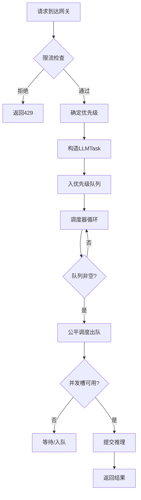
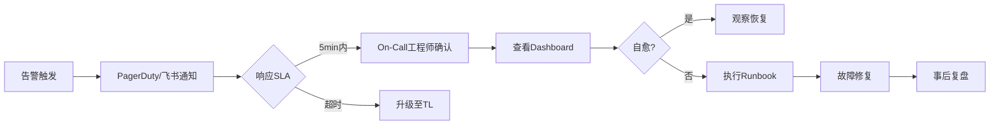

# 可观测性与限流

## 大纲

本文围绕 LLM 生产环境中的两大核心运维主题——**可观测性**与**限流**——展开深度讲解。内容涵盖可观测性三大支柱在 LLM 场景的特殊适配、基于 Langfuse 和 OpenTelemetry 的全链路追踪实战、多种分布式限流算法的对比与 Redis+Lua 原子实现、优先级队列与公平调度策略、告警体系设计，以及面试高频追问与快速回答模板。全文面向准备大模型/AI 工程师岗位面试的候选人，兼顾理论深度与工程落地细节。

---

## 一、LLM 可观测性三支柱

传统微服务的可观测性由 Metrics、Logs、Traces 三大支柱构成。LLM 应用在此基础上引入了若干独特的观测维度，使得每一支柱都需要做专门的适配。

### 1.1 三大支柱在 LLM 场景的特殊性

| 支柱 | 传统微服务 | LLM 场景特殊性 |
|------|-----------|---------------|
| **Metrics** | 请求量、延迟、错误率 | 新增 Token 消耗量、每请求成本、模型路由命中率、流式首 Token 延迟（TTFT） |
| **Logs** | 请求/响应日志 | 需记录完整 Prompt 与 Completion、上下文窗口长度、Function Call 参数、安全过滤命中详情 |
| **Traces** | 跨服务调用链 | 需覆盖 Embedding 检索、Rerank、多轮对话上下文拼接、模型推理、后处理等阶段 |

> **关键指标表**

| 指标名称 | 含义 | 典型阈值 |
|---------|------|---------|
| TTFT（Time To First Token） | 流式场景下首个 Token 的延迟 | < 500ms（P99） |
| TPS（Tokens Per Second） | 模型输出吞吐 | > 30 tokens/s |
| E2E Latency | 端到端请求延迟 | < 5s（P99） |
| Cost Per Request | 单请求 Token 成本 | 因模型而异 |
| Error Rate | 4xx/5xx 错误率 | < 0.5% |
| Context Window Usage | 上下文窗口使用率 | < 80% 警告 |

### 1.2 LLM 专属 Metrics 设计

```python
from prometheus_client import Histogram, Counter, Gauge

# 延迟分布：区分首Token延迟与总延迟
ttft_histogram = Histogram(
    'llm_ttft_seconds',
    'Time to first token',
    ['model', 'provider'],
    buckets=[0.1, 0.2, 0.5, 1.0, 2.0, 5.0, 10.0]
)

e2e_latency_histogram = Histogram(
    'llm_e2e_latency_seconds',
    'End-to-end request latency',
    ['model', 'provider', 'status'],
    buckets=[0.5, 1.0, 2.0, 5.0, 10.0, 30.0, 60.0]
)

# Token 消耗计数
token_counter = Counter(
    'llm_tokens_total',
    'Total tokens consumed',
    ['model', 'type']  # type: prompt/completion
)

# 当前并发请求数
concurrency_gauge = Gauge(
    'llm_concurrent_requests',
    'Current concurrent requests',
    ['model']
)
```

### 1.3 结构化日志方案

LLM 应用的结构化日志需要包含 Prompt 片段、Token 用量、模型元信息等字段：

```python
import json
import time
import hashlib

def build_llm_log(
    request_id: str,
    user_id: str,
    model: str,
    prompt_tokens: int,
    completion_tokens: int,
    latency_ms: float,
    status: str,
    prompt_text: str,
    completion_text: str,
    error: str = None
) -> dict:
    """构建LLM请求结构化日志"""
    return {
        "timestamp": time.time(),
        "request_id": request_id,
        "user_id": user_id,
        "model": model,
        "prompt_tokens": prompt_tokens,
        "completion_tokens": completion_tokens,
        "total_tokens": prompt_tokens + completion_tokens,
        "latency_ms": latency_ms,
        "status": status,
        "prompt_hash": hashlib.sha256(prompt_text.encode()).hexdigest()[:16],
        "prompt_preview": prompt_text[:200],
        "completion_preview": completion_text[:200],
        "error": error,
        "cost_usd": calculate_cost(model, prompt_tokens, completion_tokens)
    }
```

> **注意**：生产环境中不应将完整 Prompt 写入日志系统（数据量大且涉及隐私），应存储 Prompt 的哈希值和截断预览，完整内容通过 Trace ID 关联到专门的 Trace 存储（如 Langfuse）中查询。

---

## 二、全链路追踪实战

### 2.1 LLM 应用的 Trace 拓扑

一个典型的 RAG + Agent 场景包含多个可追踪的阶段：

```mermaid
trace-beta
    title RAG请求全链路Trace

    section 网关层
        Gateway: span: gateway.route, 120ms
        RateLimit: span: ratelimit.check, 5ms
        Auth: span: auth.verify, 15ms

    section 检索层
        Embedding: span: embedding.encode, 80ms
        VectorSearch: span: vector.search, 120ms
        Rerank: span: rerank.score, 150ms

    section 推理层
        PromptBuild: span: prompt.build, 20ms
        LLMInference: span: llm.inference, 2800ms
        StreamOutput: span: llm.stream, 3200ms

    section 后处理层
        SafetyFilter: span: safety.check, 30ms
        PostProcess: span: postprocess.format, 10ms
```

### 2.2 OpenTelemetry 集成

使用 OpenTelemetry Python SDK 构建 LLM 专用的 Span 层级：

```python
from opentelemetry import trace
from opentelemetry.sdk.trace import TracerProvider
from opentelemetry.sdk.trace.export import BatchSpanProcessor
from opentelemetry.exporter.otlp.proto.grpc.trace_exporter import OTLPSpanExporter
from opentelemetry.trace import StatusCode

# 初始化 TracerProvider
provider = TracerProvider()
exporter = OTLPSpanExporter(endpoint="http://otel-collector:4317")
provider.add_span_processor(BatchSpanProcessor(exporter))
trace.set_tracer_provider(provider)

tracer = trace.get_tracer("llm-gateway")


def handle_rag_request(query: str, user_id: str):
    """RAG请求全链路追踪"""
    with tracer.start_as_current_span("rag.request") as root_span:
        root_span.set_attribute("user.id", user_id)
        root_span.set_attribute("query.text", query[:100])

        # 1. Embedding
        with tracer.start_as_current_span("embedding.encode") as span:
            span.set_attribute("embedding.model", "bge-large-zh")
            vector = embed_query(query)
            span.set_attribute("embedding.dimension", len(vector))

        # 2. 向量检索
        with tracer.start_as_current_span("vector.search") as span:
            span.set_attribute("vector.top_k", 10)
            documents = vector_search(vector, top_k=10)
            span.set_attribute("vector.results_count", len(documents))

        # 3. Rerank
        with tracer.start_as_current_span("rerank.score") as span:
            span.set_attribute("rerank.model", "bge-reranker-large")
            reranked = rerank(query, documents)
            span.set_attribute("rerank.input_count", len(documents))
            span.set_attribute("rerank.output_count", len(reranked))

        # 4. LLM 推理
        with tracer.start_as_current_span("llm.inference") as span:
            span.set_attribute("llm.model", "qwen-72b-chat")
            span.set_attribute("llm.temperature", 0.7)
            prompt = build_prompt(query, reranked)
            span.set_attribute("llm.prompt_tokens", count_tokens(prompt))
            response = llm_call(prompt)
            span.set_attribute("llm.completion_tokens", count_tokens(response))
            span.set_attribute("llm.total_tokens",
                               count_tokens(prompt) + count_tokens(response))

        # 5. 安全过滤
        with tracer.start_as_current_span("safety.check") as span:
            safe, reason = safety_filter(response)
            span.set_attribute("safety.passed", safe)
            if not safe:
                span.set_status(StatusCode.ERROR, f"Safety filter: {reason}")
                span.record_exception(Exception(f"Safety blocked: {reason}"))

        return response
```

### 2.3 Langfuse 自部署与集成

Langfuse 是开源的 LLM 应用可观测性平台，支持 Trace 采集、Prompt 版本管理和 A/B 测试。

```python
from langfuse import Langfuse
from langfuse.decorators import observe, langfuse_context

langfuse = Langfuse(
    public_key="pk-xxx",
    secret_key="sk-xxx",
    host="https://langfuse.internal.company.com"  # 自部署地址
)

@observe(as_type="generation")
def call_llm(prompt: str, model: str = "qwen-72b-chat"):
    """Langfuse自动采集的LLM调用"""
    response = client.chat.completions.create(
        model=model,
        messages=[{"role": "user", "content": prompt}]
    )

    # 手动记录Token用量（Langfuse自动采集可能不完整）
    langfuse_context.update_current_observation(
        usage={
            "input": response.usage.prompt_tokens,
            "output": response.usage.completion_tokens,
            "total": response.usage.total_tokens
        },
        model=model,
        metadata={"temperature": 0.7}
    )
    return response.choices[0].message.content


@observe()
def rag_pipeline(query: str, user_id: str):
    """RAG全链路，Langfuse自动构建Trace树"""
    # Prompt版本管理：从Langfuse获取Prompt模板
    prompt_template = langfuse.get_prompt("rag-v2")
    context = retrieve_context(query)
    prompt = prompt_template.compile(context=context, query=query)

    answer = call_llm(prompt)
    return answer
```

**Prompt 版本管理与 A/B 测试**：

```python
# 获取Prompt模板并做A/B测试
prompt_v1 = langfuse.get_prompt("rag-v1", version=1)
prompt_v2 = langfuse.get_prompt("rag-v2", version=2)

# 基于用户ID哈希分流
import hashlib
hash_val = int(hashlib.md5(user_id.encode()).hexdigest(), 16)
selected_prompt = prompt_v1 if hash_val % 100 < 50 else prompt_v2

# Langfuse会自动记录每条Trace使用了哪个Prompt版本
response = call_llm(selected_prompt.compile(query=query, context=context))
```

### 2.4 Context Propagation 跨服务传播

在微服务架构中，Trace 上下文需要跨 HTTP/gRPC 边界传播：

```python
from opentelemetry.propagate import inject, extract
import requests

def call_retrieval_service(query: str) -> list:
    """跨服务调用时传播Trace上下文"""
    headers = {}
    inject(headers)  # 自动注入 traceparent 等头部

    resp = requests.post(
        "http://retrieval-service/search",
        json={"query": query},
        headers=headers
    )
    return resp.json()["documents"]


# 检索服务端提取上下文
from flask import Flask, request
app = Flask(__name__)

@app.route("/search", methods=["POST"])
def search():
    context = extract(request.headers)  # 从headers提取Trace上下文
    with tracer.start_as_current_span("search.execute", context=context):
        query = request.json["query"]
        results = do_search(query)
        return {"documents": results}
```

---

## 三、分布式限流设计

### 3.1 限流算法对比

| 算法 | 原理 | 优点 | 缺点 | 适用场景 |
|------|------|------|------|---------|
| **固定窗口** | 每个时间窗口计数 | 实现简单 | 窗口边界突发 | 低精度场景 |
| **滑动窗口** | 多个子窗口滑动统计 | 精度高 | 内存占用较多 | 通用 API 限流 |
| **漏桶** | 固定速率消费 | 流量平滑 | 无法应对合理突发 | 平滑输出 |
| **令牌桶** | 匀速生成令牌，允许突发 | 允许合理突发 | 实现稍复杂 | API 网关首选 |
| **滑动窗口计数器** | 加权前后窗口计数 | 精度与内存平衡 | 近似计算 | 生产推荐 |

### 3.2 LLM 场景的限流特殊性

LLM 限流与传统 API 限流有本质区别——不能仅按请求数限流，还需考虑 **Token 用量**和**并发数**：

```
请求维度限流：  QPS <= 100/s
Token维度限流：  Token消耗 <= 1,000,000 tokens/min
并发维度限流：  并发推理请求 <= 50
```

> **为什么需要多维度限流？**
>
> 一个长上下文请求可能消耗 10 万个 Token，等效于 100 个短请求的资源占用。仅按 QPS 限流无法防止个别大请求耗尽集群资源。

### 3.3 Redis + Lua 滑动窗口限流器

以下实现基于 Redis Sorted Set 的滑动窗口限流，支持多维度（请求数 + Token 数）：

```python
import redis
import time
from typing import Optional

class SlidingWindowRateLimiter:
    """基于Redis Sorted Set的滑动窗口限流器"""

    LUA_SCRIPT = """
    local key = KEYS[1]
    local window = tonumber(ARGV[1])
    local limit = tonumber(ARGV[2])
    local now = tonumber(ARGV[3])
    local member = ARGV[4]
    local weight = tonumber(ARGV[5])

    -- 移除窗口外的过期记录
    local expired = now - window
    redis.call('ZREMRANGEBYSCORE', key, '-inf', expired)

    -- 获取当前窗口内的计数
    local current = 0
    local members = redis.call('ZRANGE', key, 0, -1, 'WITHSCORES')
    for i = 2, #members, 2 do
        current = current + tonumber(members[i])
    end

    -- 判断是否超限
    if current + weight > limit then
        return {0, current, limit - current}
    end

    -- 添加当前请求
    redis.call('ZADD', key, now, member .. ':' .. now .. ':' .. math.random(100000))
    redis.call('EXPIRE', key, window + 1)

    return {1, current + weight, limit - current - weight}
    """

    def __init__(self, redis_client: redis.Redis):
        self.redis = redis_client
        self.script = self.redis.register_script(self.LUA_SCRIPT)

    def is_allowed(
        self,
        key: str,
        limit: int,
        window_seconds: int,
        weight: int = 1
    ) -> dict:
        """
        检查请求是否允许通过

        Args:
            key: 限流键（如 rate:user:123 或 token:model:qwen）
            limit: 窗口内最大限额
            window_seconds: 窗口大小（秒）
            weight: 权重（请求数为1，Token数为实际Token数）

        Returns:
            {"allowed": bool, "current": int, "remaining": int}
        """
        now = time.time()
        result = self.script(
            keys=[key],
            args=[window_seconds, limit, now, str(id(self)), weight]
        )
        return {
            "allowed": bool(result[0]),
            "current": int(result[1]),
            "remaining": int(result[2])
        }


class TokenBucketRateLimiter:
    """基于Redis的令牌桶限流器"""

    LUA_SCRIPT = """
    local key = KEYS[1]
    local capacity = tonumber(ARGV[1])      -- 桶容量
    local rate = tonumber(ARGV[2])           -- 每秒生成令牌数
    local now = tonumber(ARGV[3])            -- 当前时间戳(微秒精度)
    local requested = tonumber(ARGV[4])      -- 请求的令牌数

    -- 获取桶状态
    local data = redis.call('HMGET', key, 'tokens', 'last_time')
    local tokens = tonumber(data[1]) or capacity
    local last_time = tonumber(data[2]) or now

    -- 计算新增令牌
    local elapsed = now - last_time
    local new_tokens = elapsed * rate
    tokens = math.min(capacity, tokens + new_tokens)

    -- 判断是否充足
    if tokens < requested then
        redis.call('HMSET', key, 'tokens', tokens, 'last_time', now)
        redis.call('EXPIRE', key, math.ceil(capacity / rate) + 1)
        return {0, math.floor(tokens), 0}
    end

    -- 消耗令牌
    tokens = tokens - requested
    redis.call('HMSET', key, 'tokens', tokens, 'last_time', now)
    redis.call('EXPIRE', key, math.ceil(capacity / rate) + 1)
    return {1, math.floor(tokens), requested}
    """

    def __init__(self, redis_client: redis.Redis):
        self.redis = redis_client
        self.script = self.redis.register_script(self.LUA_SCRIPT)

    def acquire(self, key: str, capacity: int, rate: float, tokens: int = 1) -> dict:
        now = time.time()
        result = self.script(
            keys=[key],
            args=[capacity, rate, now, tokens]
        )
        return {
            "allowed": bool(result[0]),
            "remaining_tokens": int(result[1]),
            "consumed": int(result[2])
        }
```

### 3.4 多维度限流中间件

```python
from fastapi import FastAPI, Request, HTTPException
from starlette.middleware.base import BaseHTTPMiddleware
import redis

app = FastAPI()
redis_client = redis.Redis(host="localhost", port=6379, decode_responses=True)
limiter = SlidingWindowRateLimiter(redis_client)
token_bucket = TokenBucketRateLimiter(redis_client)


class LLMLimitMiddleware(BaseHTTPMiddleware):
    """LLM网关多维度限流中间件"""

    def __init__(self, app, config: dict):
        super().__init__(app)
        self.config = config

    async def dispatch(self, request: Request, call_next):
        user_id = request.headers.get("X-User-Id", "anonymous")
        model = request.query_params.get("model", "default")

        # 维度1：用户QPS限流
        result = limiter.is_allowed(
            key=f"qps:user:{user_id}",
            limit=self.config["user_qps_limit"],
            window_seconds=1
        )
        if not result["allowed"]:
            raise HTTPException(
                status_code=429,
                detail="Rate limit exceeded (QPS)",
                headers={
                    "X-RateLimit-Limit": str(self.config["user_qps_limit"]),
                    "X-RateLimit-Remaining": "0",
                    "Retry-After": "1"
                }
            )

        # 维度2：模型并发限流（令牌桶）
        result = token_bucket.acquire(
            key=f"concurrency:model:{model}",
            capacity=self.config["model_concurrency"],
            rate=self.config["model_recovery_rate"],
            tokens=1
        )
        if not result["allowed"]:
            raise HTTPException(
                status_code=429,
                detail="Model concurrency limit exceeded",
                headers={"Retry-After": "5"}
            )

        response = await call_next(request)

        # 维度3：Token用量限流（异步，从响应中提取Token数后更新）
        # 此处简化，实际应在响应完成后根据usage更新
        return response
```

---

## 四、优先级队列与调度

### 4.1 优先级设计

生产环境中不同用户和请求有不同的优先级，需要实现差异化调度：

| 优先级 | 用户类型 | SLA | 限流倍数 |
|--------|---------|-----|---------|
| P0 - 最高 | 内部核心链路 | 99.9% 可用，P99 < 2s | 不限流 |
| P1 - 高 | VIP/付费用户 | 99.5% 可用，P99 < 5s | 2x 基线 |
| P2 - 普通 | 免费用户 | 99% 可用，P99 < 10s | 1x 基线 |
| P3 - 低 | 批量任务 | 尽力而为 | 0.5x 基线 |

### 4.2 Redis 优先级队列实现

```python
import redis
import json
import time
import threading
from dataclasses import dataclass, field
from typing import Callable, Optional
from concurrent.futures import Future
from enum import IntEnum

class Priority(IntEnum):
    P0_CRITICAL = 0
    P1_HIGH = 1
    P2_NORMAL = 2
    P3_LOW = 3


@dataclass
class LLMTask:
    task_id: str
    user_id: str
    priority: Priority
    prompt: str
    model: str
    created_at: float = field(default_factory=time.time)
    token_budget: int = 4096
    timeout: float = 30.0

    def to_dict(self) -> dict:
        return {
            "task_id": self.task_id,
            "user_id": self.user_id,
            "priority": self.priority.value,
            "prompt": self.prompt,
            "model": self.model,
            "created_at": self.created_at,
            "token_budget": self.token_budget,
            "timeout": self.timeout
        }

    @classmethod
    def from_dict(cls, d: dict) -> "LLMTask":
        return cls(
            task_id=d["task_id"],
            user_id=d["user_id"],
            priority=Priority(d["priority"]),
            prompt=d["prompt"],
            model=d["model"],
            created_at=d["created_at"],
            token_budget=d["token_budget"],
            timeout=d["timeout"]
        )


class PriorityTaskQueue:
    """基于Redis Sorted Set的优先级任务队列"""

    def __init__(self, redis_client: redis.Redis, queue_name: str = "llm:task_queue"):
        self.redis = redis_client
        self.queue_name = queue_name

    def enqueue(self, task: LLMTask) -> None:
        """入队：score = priority * 1e12 + timestamp，保证同优先级按FIFO"""
        score = task.priority.value * 1e12 + task.created_at
        self.redis.zadd(
            self.queue_name,
            {json.dumps(task.to_dict()): score}
        )

    def dequeue(self, max_count: int = 1) -> list[LLMTask]:
        """出队：取出score最小（优先级最高）的任务"""
        results = self.redis.zpopmin(self.queue_name, count=max_count)
        tasks = []
        for member, score in results:
            tasks.append(LLMTask.from_dict(json.loads(member)))
        return tasks

    def size(self) -> dict:
        """各优先级队列长度"""
        all_items = self.redis.zrange(self.queue_name, 0, -1, withscores=True)
        counts = {p.name: 0 for p in Priority}
        for member, score in all_items:
            priority_val = int(score / 1e12)
            try:
                counts[Priority(priority_val).name] += 1
            except ValueError:
                pass
        return counts

    def peek(self, count: int = 10) -> list[LLMTask]:
        """查看队首任务（不取出）"""
        results = self.redis.zrange(self.queue_name, 0, count - 1, withscores=True)
        return [LLMTask.from_dict(json.loads(m)) for m, s in results]


class FairScheduler:
    """公平调度器：防止低优先级任务饿死"""

    def __init__(self, queue: PriorityTaskQueue, starvation_threshold: float = 30.0):
        self.queue = queue
        self.starvation_threshold = starvation_threshold  # 秒

    def dequeue_fair(self) -> Optional[LLMTask]:
        """公平出队：优先高优先级，但低优先级等待过久会提升优先级"""
        candidates = self.queue.peek(count=50)
        if not candidates:
            return None

        now = time.time()
        boosted = []
        for task in candidates:
            wait_time = now - task.created_at
            # 等待超过阈值的低优先级任务自动提升
            effective_priority = task.priority.value
            if wait_time > self.starvation_threshold and task.priority.value > 0:
                effective_priority = max(0, task.priority.value - 1)
            boosted.append((effective_priority, task.created_at, task))

        boosted.sort(key=lambda x: (x[0], x[1]))
        selected = boosted[0][2]

        # 从队列中移除选中的任务
        self.redis.zrem(
            self.queue.queue_name,
            json.dumps(selected.to_dict())
        )
        return selected
```

### 4.3 调度器工作流程



---

## 五、告警与 On-Call

### 5.1 告警指标与阈值

| 告警名称 | 指标 | 条件 | 级别 | 处理方式 |
|---------|------|------|------|---------|
| 高延迟告警 | P99 E2E Latency | > 10s 持续 5min | P1 | 检查模型负载/切换模型 |
| 错误率告警 | 5xx Error Rate | > 1% 持续 3min | P0 | 立即检查服务状态 |
| Token 消耗异常 | 单用户 Token/分钟 | > 10x 均值 | P2 | 检查是否有异常调用 |
| 队列堆积告警 | 待处理任务数 | > 1000 持续 2min | P1 | 扩容或降级 |
| 模型不可用 | 模型健康检查 | 3次连续失败 | P0 | 自动切换备用模型 |
| 成本异常 | 日累计成本 | > 预算150% | P2 | 通知运营团队 |

### 5.2 告警规则配置（Prometheus AlertManager）

```yaml
groups:
  - name: llm_gateway_alerts
    rules:
      - alert: LLMHighLatencyP99
        expr: histogram_quantile(0.99, rate(llm_e2e_latency_seconds_bucket[5m])) > 10
        for: 5m
        labels:
          severity: p1
          team: llm-platform
        annotations:
          summary: "LLM P99延迟超过10秒"
          description: "模型 {{ $labels.model }} 的P99延迟为 {{ $value }}s"

      - alert: LLMHighErrorRate
        expr: |
          sum(rate(llm_requests_total{status=~"5.."}[3m]))
          /
          sum(rate(llm_requests_total[3m])) > 0.01
        for: 3m
        labels:
          severity: p0
        annotations:
          summary: "LLM错误率超过1%"

      - alert: LLMTokenConsumptionAnomaly
        expr: |
          rate(llm_tokens_total{type="completion"}[5m])
          >
          10 * avg_over_time(rate(llm_tokens_total{type="completion"}[5m])[1h:5m])
        for: 5m
        labels:
          severity: p2
        annotations:
          summary: "Token消耗速率异常偏高"
```

### 5.3 On-Call 流程



**典型 Runbook 示例**：

| 告警 | 第一步 | 第二步 | 第三步 |
|------|--------|--------|--------|
| 高延迟 | 检查模型服务 CPU/GPU 利用率 | 检查上游 Provider 状态 | 切换至备用模型 |
| 高错误率 | 检查最近部署变更 | 回滚至前一版本 | 检查下游依赖 |
| Token 异常 | 查看异常用户列表 | 临时限流该用户 | 联系客户确认 |

---

## 六、面试高频追问

### Q1: LLM 应用的可观测性和传统微服务有什么本质区别？

**参考答案**：传统微服务可观测性关注请求量、延迟、错误率三个维度，而 LLM 应用在此基础上需要额外观测 **Token 消耗**（成本维度）、**上下文窗口使用率**（资源维度）、**TTFT 首 Token 延迟**（体验维度，区别于传统 TTFB）、**模型路由命中率**（调度维度）。此外，LLM 的 Prompt 和 Completion 本身是高价值业务数据，需要在可观测性体系中妥善存储和关联，而非仅作为普通日志处理。Trace 的粒度也不同：传统服务 Trace 到 RPC 调用级别，LLM 需要 Trace 到 Embedding、Rerank、推理、安全过滤等子阶段。

### Q2: 为什么 LLM 网关需要多维度限流？仅按 QPS 限流有什么问题？

**参考答案**：LLM 请求的资源消耗差异极大——一个包含 10 万 Token 上下文的请求和一个 100 Token 的简单查询，在 GPU 上的计算量和内存占用相差千倍。仅按 QPS 限流会出现以下问题：(1) 大请求霸占 GPU 资源导致后续请求排队；(2) Token 消耗无上限导致成本失控；(3) 并发请求过多导致 OOM。因此需要同时限制 QPS（流量维度）、Token 速率（成本维度）和并发数（资源维度），三个维度互为补充。

### Q3: Redis + Lua 实现限流的原子性是怎么保证的？

**参考答案**：Redis 使用单线程模型执行命令，Lua 脚本在 Redis 中的执行是原子的——脚本执行期间不会被其他命令打断。我们把「查询当前计数 → 判断是否超限 → 更新计数」这三步操作写在一个 Lua 脚本中，保证了 check-then-act 的原子性，避免了并发场景下的竞态条件。相比先 GET 再 SET 的两步操作，Lua 脚本不会出现两个请求同时通过检查的情况。此外，Redis 的 EVALSHA 命令会缓存脚本 SHA，减少了网络传输开销。

### Q4: 滑动窗口和令牌桶在 LLM 限流中各适用于什么场景？

**参考答案**：**滑动窗口**适用于按时间维度精确控制请求数或 Token 数的场景，比如「每分钟每个用户最多消耗 10 万 Token」。它的优点是精确控制总量，缺点是无法处理突发。**令牌桶**适用于需要允许合理突发的场景，比如「平均每秒 10 个请求，但允许瞬间突发 20 个」。桶容量控制突发上限，生成速率控制平均速率。生产中通常两者结合使用：令牌桶控制瞬时突发，滑动窗口控制长时间总量。

### Q5: 如何设计 LLM 场景的告警去重和降噪？

**参考答案**：(1) **聚合告警**：相同告警规则在时间窗口内只发一次，使用 AlertManager 的 group_by 和 group_wait 配置；(2) **分级告警**：P0 告警立即电话通知，P1 飞书/钉钉通知，P2 仅记录不通知；(3) **上下文关联**：告警附带 Dashboard 链接和 Trace ID，减少排查时间；(4) **抑制规则**：当上游 Provider 整体故障时，抑制所有下游单模型告警；(5) **自愈优先**：对于可自愈的问题（如单模型超时自动切换备用模型），设置静默期，自愈成功则不触发告警。

### Q6: Langfuse 相比自建 Trace 系统有什么优劣？

**参考答案**：**优势**：(1) 开源可自部署，数据不出内网；(2) 内置 Prompt 版本管理和 A/B 测试能力；(3) 提供 Python/JS SDK，与 LangChain/LlamaIndex 深度集成；(4) 支持评估打分和数据集管理。**劣势**：(1) 大规模 Trace 数据写入性能需自行优化（分区、归档）；(2) 对自定义 Span 属性的支持不如原生 OpenTelemetry 灵活；(3) 社区版功能有限，部分高级功能（如 Playground）需要付费。生产中常见方案是 Langfuse + OpenTelemetry 并用：OTel 负责基础设施层面的 Trace，Langfuse 负责 LLM 业务层面的观测。

### Q7: 优先级队列如何防止低优先级任务饿死？

**参考答案**：纯优先级队列会导致低优先级任务永远得不到处理（饿死）。解决方案包括：(1) **等待时间提升**：低优先级任务等待超过阈值后自动提升优先级；(2) **配额保障**：每个优先级保证最低一定比例的处理配额（如 P2 最少占 20% 带宽）；(3) **时间片轮转**：在每个调度周期中，先处理一个高优先级任务，再处理一个低优先级任务；(4) **公平调度算法**：如加权公平队列（WFQ），按权重分配处理能力。我们的实现采用方案 (1)，等待超过 30 秒的任务自动提升一级优先级。

---

## 七、快速回答模板

**Q: 简述 LLM 可观测性三支柱**

> LLM 可观测性在传统 Metrics、Logs、Traces 三支柱基础上做了专项扩展。Metrics 新增 Token 消耗量、TTFT 首 Token 延迟、每请求成本等指标；Logs 需记录 Prompt/Completion 摘要和 Token 用量，但完整内容应通过 Trace ID 关联到专用存储；Traces 需覆盖 Embedding、检索、Rerank、推理、安全过滤等 LLM 特有子阶段。推荐使用 Langfuse 处理业务层观测、OpenTelemetry 处理基础设施层 Trace。

**Q: 如何实现分布式限流？**

> 生产推荐 Redis + Lua 脚本实现原子限流。核心思路是将「查窗口计数 → 判断超限 → 更新计数」放在一个 Lua 脚本中，利用 Redis 单线程原子执行保证一致性。算法选择上，滑动窗口适合精确控制总量，令牌桶适合允许突发。LLM 场景需要多维度限流：QPS 控制流量、Token 速率控制成本、并发数控制资源，三者互补。

**Q: 如何设计 LLM 网关的告警？**

> 核心原则是分级、聚合、可操作。按严重程度分为 P0（立即电话通知）、P1（即时消息通知）、P2（仅记录）。关键指标包括 P99 延迟、错误率、Token 消耗异常、队列堆积深度。告警需附带 Dashboard 链接和 Trace ID 便于快速定位。同时配置抑制规则（上游故障时抑制下游告警）和 Runbook（每个告警对应标准化处理流程），减少噪音和 MTTR。

**Q: 优先级队列和公平调度怎么结合？**

> 使用 Redis Sorted Set 实现优先级队列，score 由优先级和时间戳组合保证同优先级 FIFO。为防止低优先级任务饿死，引入公平调度机制：等待超过阈值的任务自动提升优先级，或采用加权公平队列按比例分配处理能力。同时配合限流器对不同优先级设置不同的限流倍数，实现端到端的差异化服务。

**Q: 全链路追踪的 Span 如何设计？**

> LLM 应用的 Span 设计应按业务阶段划分：Gateway（鉴权、限流）→ 检索（Embedding、向量搜索、Rerank）→ 推理（Prompt 构建、模型调用、流式输出）→ 后处理（安全过滤、格式化）。每个 Span 记录关键属性（模型名、Token 数、Top-K 等），跨服务通过 W3C traceparent 头传播上下文。推荐使用 Langfuse 的 @observe 装饰器自动构建 Trace 树，结合 OpenTelemetry SDK 采集基础设施指标。

---

> **总结**：可观测性与限流是 LLM 生产系统的两大基石。可观测性让你「看到问题」，限流让你「控制风险」。面试中要能清晰对比 LLM 场景与传统微服务的差异，掌握 Redis+Lua 限流的原子性原理，理解多维度限流的必要性，并能设计合理的告警分级与 On-Call 流程。
