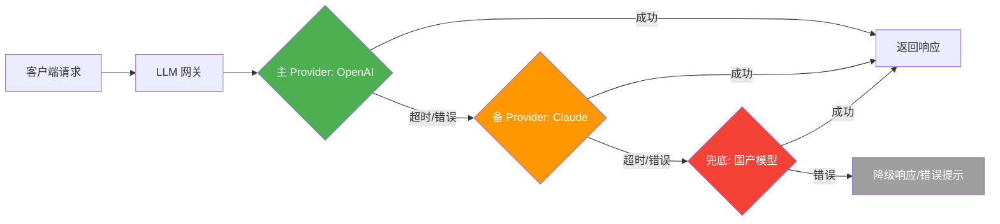
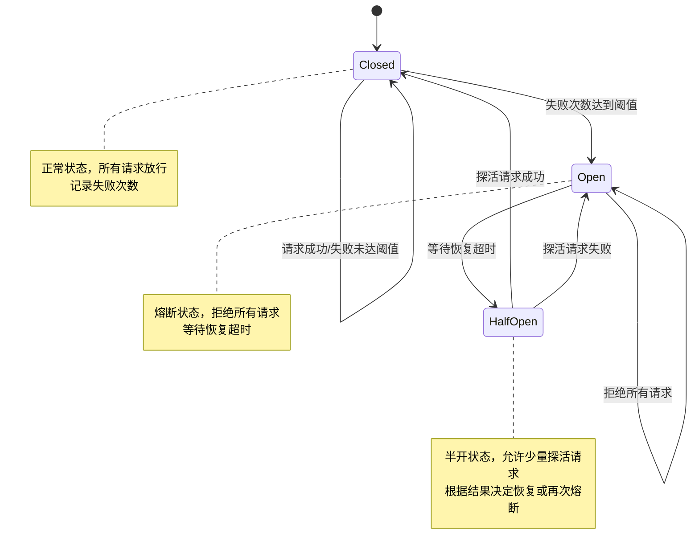
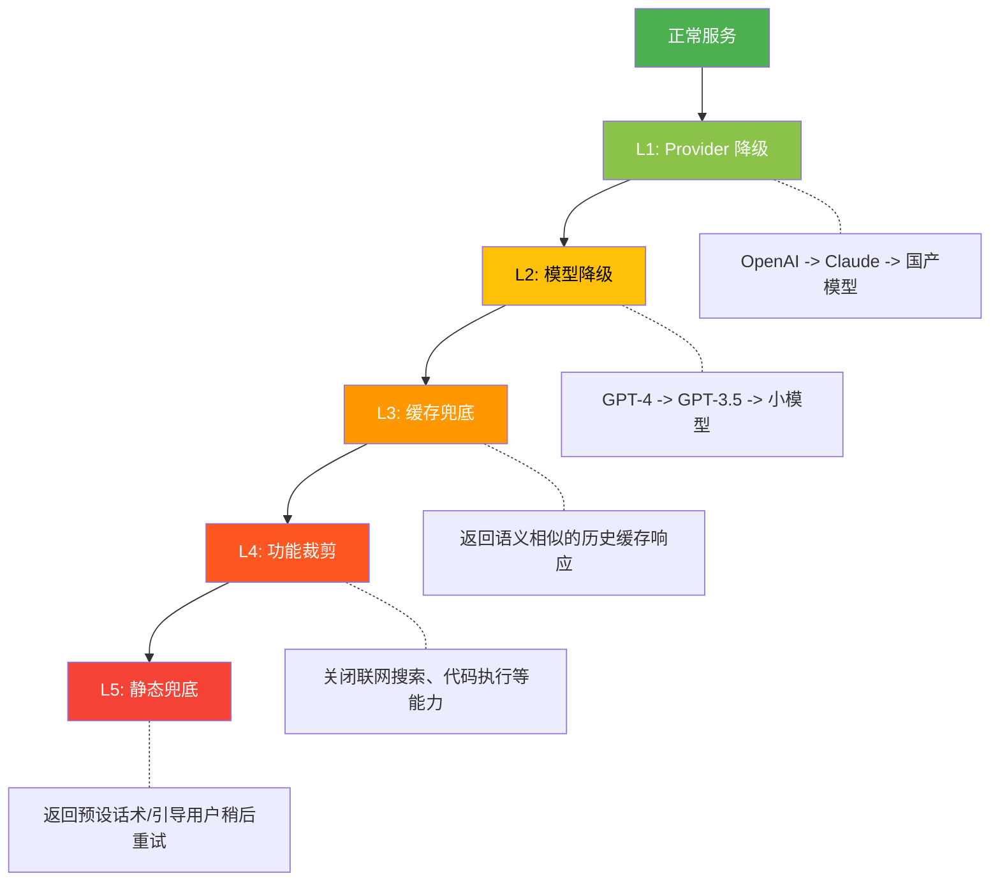

# 47. 高可用与故障转移

## 大纲

在大模型网关与运维体系中，高可用（High Availability）与故障转移（Failover）是保障 LLM 服务在生产环境中稳定运行的核心能力。本文将系统性地讲解多 Provider 故障转移机制、熔断器模式、降级策略与缓存兜底、API Key 安全与轮转、SLA 保障与容灾演练等关键主题，并辅以完整的 Python 实现和生产案例分析，帮助读者在面试中展现对大模型服务可靠性工程的深入理解。

**核心知识点：**

- 多 Provider 故障转移链路设计与实现
- 熔断器三态状态机：Closed / Open / Half-Open
- 降级策略：缓存响应、模型降级、功能裁剪
- API Key 管理：自动轮转、泄露检测、HashiCorp Vault 集成
- SLA 保障：可用性计算、容灾演练方案
- 重试策略：指数退避、抖动、幂等性保证
- 生产级故障恢复案例分析

---

## 一、高可用架构概述

### 1.1 什么是高可用

高可用（HA）是指系统在面对各种故障场景时，仍能持续提供服务的能力。在 LLM 服务中，高可用面临的挑战尤为特殊：

| 故障类型 | 传统服务 | LLM 服务 |
|---------|---------|---------|
| 网络抖动 | 自动重连即可 | 可能导致长文本生成中断，需考虑流式续传 |
| 上游依赖 | 数据库主从切换 | 多 Provider 故障转移，模型能力差异 |
| 流量突增 | 水平扩容 | GPU 资源有限，需排队或降级模型 |
| 服务过载 | 限流拒接 | 单次请求 token 消耗差异极大 |
| 区域故障 | 多机房切换 | 部分模型仅在特定区域部署 |

### 1.2 可用性指标定义

可用性通常用"几个 9"来衡量：

| 等级 | 可用性 | 年停机时间 | 适用场景 |
|------|--------|-----------|---------|
| 两个 9 | 99% | 3.65 天 | 内部工具 |
| 三个 9 | 99.9% | 8.76 小时 | 一般业务系统 |
| 四个 9 | 99.99% | 52.6 分钟 | 核心生产系统 |
| 五个 9 | 99.999% | 5.26 分钟 | 金融级系统 |

对于 LLM 网关服务，通常要求达到 **三个 9（99.9%）** 以上，即年停机时间不超过 8.76 小时。

### 1.3 高可用架构全景

LLM 网关的高可用架构通常包含以下层次：

1. **接入层**：负载均衡（Nginx/Envoy）、多活部署
2. **网关层**：请求路由、熔断降级、限流、认证鉴权
3. **调度层**：多 Provider 调度、故障转移、负载均衡
4. **Provider 层**：OpenAI、Claude、国产大模型等多个上游
5. **数据层**：缓存（Redis）、日志（ElasticSearch）、监控（Prometheus）

---

## 二、多 Provider 故障转移

### 2.1 故障转移链路设计

多 Provider 故障转移是 LLM 网关可靠性的第一道防线。典型的故障转移链路如下：



### 2.2 故障转移路由器实现

```python
import asyncio
import time
import random
from dataclasses import dataclass, field
from enum import Enum
from typing import Optional, Callable, Any
from collections import defaultdict
import httpx
import logging

logger = logging.getLogger(__name__)


class ProviderStatus(Enum):
    HEALTHY = "healthy"
    DEGRADED = "degraded"
    UNHEALTHY = "unhealthy"


@dataclass
class ProviderConfig:
    name: str
    base_url: str
    api_key: str
    model: str
    priority: int  # 优先级，数值越小越优先
    timeout: float = 30.0
    max_retries: int = 2
    rate_limit: int = 100  # 每分钟最大请求数
    cost_per_1k_tokens: float = 0.0  # 每千 token 成本


@dataclass
class ProviderHealth:
    status: ProviderStatus = ProviderStatus.HEALTHY
    success_count: int = 0
    failure_count: int = 0
    consecutive_failures: int = 0
    last_success: float = 0
    last_failure: float = 0
    avg_latency: float = 0
    p99_latency: float = 0
    latency_window: list = field(default_factory=list)
    current_minute_requests: int = 0
    minute_start: float = 0

    def update_success(self, latency: float):
        self.success_count += 1
        self.consecutive_failures = 0
        self.last_success = time.time()
        self.latency_window.append(latency)
        if len(self.latency_window) > 100:
            self.latency_window.pop(0)
        self.avg_latency = sum(self.latency_window) / len(self.latency_window)
        sorted_lat = sorted(self.latency_window)
        self.p99_latency = sorted_lat[int(len(sorted_lat) * 0.99)]
        # 状态恢复
        if self.status == ProviderStatus.DEGRADED and self.consecutive_failures == 0:
            self.status = ProviderStatus.HEALTHY
            logger.info(f"Provider {self.name} recovered to HEALTHY")

    def update_failure(self, error: str):
        self.failure_count += 1
        self.consecutive_failures += 1
        self.last_failure = time.time()
        # 连续失败 3 次降级，5 次标记不健康
        if self.consecutive_failures >= 5:
            self.status = ProviderStatus.UNHEALTHY
        elif self.consecutive_failures >= 3:
            self.status = ProviderStatus.DEGRADED


class FailoverRouter:
    """多 Provider 故障转移路由器"""

    def __init__(self, providers: list[ProviderConfig]):
        self.providers = sorted(providers, key=lambda p: p.priority)
        self.health: dict[str, ProviderHealth] = defaultdict(ProviderHealth)
        self.circuit_breakers: dict[str, CircuitBreaker] = {}
        for p in self.providers:
            self.circuit_breakers[p.name] = CircuitBreaker(
                failure_threshold=5,
                recovery_timeout=60,
                half_open_max_calls=3
            )

    async def route_request(
        self,
        messages: list[dict],
        **kwargs
    ) -> dict:
        """带故障转移的请求路由"""
        last_error = None
        attempted = []

        for provider in self.providers:
            # 检查熔断器状态
            cb = self.circuit_breakers[provider.name]
            if not cb.allow_request():
                logger.warning(
                    f"Provider {provider.name} circuit breaker OPEN, skipping"
                )
                attempted.append((provider.name, "circuit_open"))
                continue

            # 检查健康状态
            health = self.health[provider.name]
            if health.status == ProviderStatus.UNHEALTHY:
                # 给 UNHEALTHY 状态的 provider 一个探活机会
                if time.time() - health.last_failure < 120:
                    logger.warning(
                        f"Provider {provider.name} UNHEALTHY, skipping"
                    )
                    attempted.append((provider.name, "unhealthy"))
                    continue

            # 检查速率限制
            if not self._check_rate_limit(provider):
                attempted.append((provider.name, "rate_limited"))
                continue

            # 尝试请求
            try:
                start = time.time()
                response = await self._call_provider(
                    provider, messages, **kwargs
                )
                latency = time.time() - start
                health.update_success(latency)
                cb.record_success()
                logger.info(
                    f"Request succeeded on {provider.name}, "
                    f"latency={latency:.2f}s"
                )
                return response

            except Exception as e:
                last_error = e
                health.update_failure(str(e))
                cb.record_failure()
                attempted.append((provider.name, str(e)))
                logger.warning(
                    f"Provider {provider.name} failed: {e}"
                )
                continue

        # 所有 Provider 都失败
        logger.error(f"All providers failed: {attempted}")
        raise RuntimeError(
            f"All providers exhausted. Attempts: {attempted}. "
            f"Last error: {last_error}"
        )

    def _check_rate_limit(self, provider: ProviderConfig) -> bool:
        """检查速率限制"""
        health = self.health[provider.name]
        now = time.time()
        if now - health.minute_start >= 60:
            health.current_minute_requests = 0
            health.minute_start = now
        if health.current_minute_requests >= provider.rate_limit:
            return False
        health.current_minute_requests += 1
        return True

    async def _call_provider(
        self,
        provider: ProviderConfig,
        messages: list[dict],
        **kwargs
    ) -> dict:
        """调用具体的 Provider"""
        async with httpx.AsyncClient(timeout=provider.timeout) as client:
            headers = {
                "Authorization": f"Bearer {provider.api_key}",
                "Content-Type": "application/json"
            }
            payload = {
                "model": provider.model,
                "messages": messages,
                **kwargs
            }

            for attempt in range(provider.max_retries):
                try:
                    resp = await client.post(
                        f"{provider.base_url}/v1/chat/completions",
                        json=payload,
                        headers=headers
                    )
                    if resp.status_code == 200:
                        return resp.json()
                    elif resp.status_code == 429:
                        # 速率限制，等待后重试
                        wait = min(2 ** attempt * 0.5, 10)
                        await asyncio.sleep(wait)
                        continue
                    else:
                        raise RuntimeError(
                            f"API error {resp.status_code}: {resp.text}"
                        )
                except httpx.TimeoutException:
                    if attempt == provider.max_retries - 1:
                        raise
                    await asyncio.sleep(0.5)

            raise RuntimeError(f"Max retries exceeded for {provider.name}")

    def get_status_report(self) -> dict:
        """获取所有 Provider 状态报告"""
        report = {}
        for p in self.providers:
            h = self.health[p.name]
            cb = self.circuit_breakers[p.name]
            report[p.name] = {
                "health_status": h.status.value,
                "circuit_state": cb.state.value,
                "success_count": h.success_count,
                "failure_count": h.failure_count,
                "consecutive_failures": h.consecutive_failures,
                "avg_latency": f"{h.avg_latency:.2f}s",
                "p99_latency": f"{h.p99_latency:.2f}s",
            }
        return report
```

### 2.3 重试策略：指数退避与抖动

在故障转移过程中，合理的重试策略至关重要。直接使用固定间隔重试可能导致"惊群效应"（Thundering Herd），大量请求同时涌入某个恢复中的 Provider：

```python
import random


class RetryStrategy:
    """重试策略，支持指数退避和抖动"""

    @staticmethod
    def exponential_backoff_with_jitter(
        attempt: int,
        base_delay: float = 1.0,
        max_delay: float = 30.0,
        jitter_factor: float = 0.5
    ) -> float:
        """
        指数退避 + 随机抖动
        公式: delay = min(base * 2^attempt, max) * (1 + random(-jitter, jitter))
        """
        delay = min(base_delay * (2 ** attempt), max_delay)
        jitter = delay * jitter_factor
        return delay + random.uniform(-jitter, jitter)

    @staticmethod
    def decorrelated_jitter(
        attempt: int,
        base_delay: float = 1.0,
        max_delay: float = 30.0,
        prev_delay: float = 0
    ) -> float:
        """
        去相关抖动（AWS 推荐策略）
        公式: delay = min(base + random(0, prev_delay * 3), max)
        """
        if prev_delay == 0:
            prev_delay = base_delay
        delay = min(base_delay + random.uniform(0, prev_delay * 3), max_delay)
        return delay
```

::: tip 重试策略对比
- **固定间隔**：简单但不推荐，容易导致惊群效应
- **指数退避**：逐步延长等待时间，适合瞬时故障
- **指数退避 + 抖动**：在指数退避基础上加入随机性，推荐使用
- **去相关抖动**：AWS 推荐的策略，抖动范围与前一次延迟相关，分布更均匀
:::

### 2.4 幂等性保证

在故障转移和重试场景下，幂等性是必须考虑的问题。如果一个请求在上游已经执行成功，但响应在传输过程中丢失，网关自动重试可能导致重复执行：

```python
import hashlib
import uuid


class IdempotencyManager:
    """幂等性管理器"""

    def __init__(self, redis_client):
        self.redis = redis_client
        self.default_ttl = 3600  # 1 小时

    def generate_idempotency_key(
        self,
        user_id: str,
        messages: list[dict],
        model: str
    ) -> str:
        """根据请求内容生成幂等键"""
        content = f"{user_id}:{model}:{str(messages)}"
        return hashlib.sha256(content.encode()).hexdigest()[:32]

    async def check_and_set(
        self,
        idempotency_key: str,
        ttl: int = None
    ) -> Optional[dict]:
        """
        检查是否有相同的已完成请求。
        返回 None 表示是新请求，返回 dict 表示是重复请求。
        """
        ttl = ttl or self.default_ttl
        # 使用 Redis SET NX 实现原子性检查
        result = await self.redis.get(f"idempotency:{idempotency_key}")
        if result:
            import json
            return json.loads(result)
        # 标记为处理中
        await self.redis.setex(
            f"idempotency:{idempotency_key}",
            ttl,
            "processing"
        )
        return None

    async def store_result(
        self,
        idempotency_key: str,
        response: dict,
        ttl: int = None
    ):
        """存储请求结果"""
        import json
        ttl = ttl or self.default_ttl
        await self.redis.setex(
            f"idempotency:{idempotency_key}",
            ttl,
            json.dumps(response)
        )
```

::: warning 幂等性关键点
对于 LLM 生成类请求，即使使用相同的输入和参数，每次生成的结果也可能不同。因此幂等性策略需要根据业务场景选择：
- **对话场景**：不建议使用幂等键，因为每次对话应该是独立的
- **任务执行场景**（如代码生成、文档转换）：适合使用幂等键，避免重复执行
- **流式请求**：需要在首次完整响应后才写入幂等缓存
:::

---

## 三、熔断器模式

### 3.1 熔断器状态机

熔断器（Circuit Breaker）模式是微服务架构中保护系统稳定性的经典模式。在 LLM 网关中，熔断器用于防止持续向已故障的 Provider 发送请求，避免级联故障：



### 3.2 熔断器完整实现

```python
import time
import threading
from enum import Enum
from dataclasses import dataclass, field
from typing import Optional
import logging

logger = logging.getLogger(__name__)


class CircuitState(Enum):
    CLOSED = "closed"         # 正常：请求正常通过
    OPEN = "open"             # 熔断：拒绝所有请求
    HALF_OPEN = "half_open"   # 半开：允许探活请求


@dataclass
class CircuitBreaker:
    """熔断器实现"""

    failure_threshold: int = 5          # 连续失败次数阈值
    success_threshold: int = 3          # 半开状态成功次数阈值
    recovery_timeout: float = 60.0      # 恢复等待时间（秒）
    half_open_max_calls: int = 3        # 半开状态最大并发探活请求数
    slow_call_threshold: float = 30.0   # 慢调用阈值（秒）
    slow_call_rate_threshold: float = 0.5  # 慢调用比例阈值

    # 内部状态
    state: CircuitState = CircuitState.CLOSED
    failure_count: int = 0
    success_count: int = 0
    half_open_calls: int = 0
    last_failure_time: float = 0
    last_state_change: float = field(default_factory=time.time)
    window_failures: list = field(default_factory=list)
    window_size: float = 60.0  # 滑动窗口大小（秒）

    # 统计数据
    total_requests: int = 0
    total_failures: int = 0
    total_rejected: int = 0

    _lock: threading.Lock = field(default_factory=threading.Lock)

    def allow_request(self) -> bool:
        """判断是否允许请求通过"""
        with self._lock:
            self._cleanup_window()
            self.total_requests += 1

            if self.state == CircuitState.CLOSED:
                return True

            elif self.state == CircuitState.OPEN:
                if self._should_attempt_recovery():
                    self._transition_to(CircuitState.HALF_OPEN)
                    self.half_open_calls = 1
                    logger.info("Circuit breaker: OPEN -> HALF_OPEN")
                    return True
                self.total_rejected += 1
                return False

            elif self.state == CircuitState.HALF_OPEN:
                if self.half_open_calls < self.half_open_max_calls:
                    self.half_open_calls += 1
                    return True
                self.total_rejected += 1
                return False

            return False

    def record_success(self):
        """记录请求成功"""
        with self._lock:
            if self.state == CircuitState.HALF_OPEN:
                self.success_count += 1
                if self.success_count >= self.success_threshold:
                    self._transition_to(CircuitState.CLOSED)
                    self.failure_count = 0
                    self.success_count = 0
                    self.half_open_calls = 0
                    logger.info("Circuit breaker: HALF_OPEN -> CLOSED")
            elif self.state == CircuitState.CLOSED:
                # 成功时衰减失败计数
                self.failure_count = max(0, self.failure_count - 1)

    def record_failure(self, error: str = ""):
        """记录请求失败"""
        with self._lock:
            self.total_failures += 1
            self.failure_count += 1
            self.last_failure_time = time.time()
            self.window_failures.append(time.time())

            if self.state == CircuitState.CLOSED:
                if self.failure_count >= self.failure_threshold:
                    self._transition_to(CircuitState.OPEN)
                    logger.warning(
                        f"Circuit breaker: CLOSED -> OPEN "
                        f"(failures={self.failure_count})"
                    )

            elif self.state == CircuitState.HALF_OPEN:
                self._transition_to(CircuitState.OPEN)
                self.half_open_calls = 0
                self.success_count = 0
                logger.warning("Circuit breaker: HALF_OPEN -> OPEN")

    def _should_attempt_recovery(self) -> bool:
        """判断是否应该尝试恢复"""
        return time.time() - self.last_failure_time >= self.recovery_timeout

    def _transition_to(self, new_state: CircuitState):
        """状态转换"""
        self.state = new_state
        self.last_state_change = time.time()

    def _cleanup_window(self):
        """清理过期的失败记录"""
        now = time.time()
        self.window_failures = [
            t for t in self.window_failures
            if now - t <= self.window_size
        ]

    def get_metrics(self) -> dict:
        """获取熔断器指标"""
        return {
            "state": self.state.value,
            "failure_count": self.failure_count,
            "success_count": self.success_count,
            "total_requests": self.total_requests,
            "total_failures": self.total_failures,
            "total_rejected": self.total_rejected,
            "rejection_rate": (
                self.total_rejected / max(1, self.total_requests)
            ),
            "last_failure": self.last_failure_time,
            "uptime_since_change": (
                time.time() - self.last_state_change
            ),
        }

    def force_open(self):
        """强制熔断（运维操作）"""
        with self._lock:
            self._transition_to(CircuitState.OPEN)
            self.last_failure_time = time.time()
            logger.warning("Circuit breaker force opened by operator")

    def force_close(self):
        """强制关闭（运维操作）"""
        with self._lock:
            self._transition_to(CircuitState.CLOSED)
            self.failure_count = 0
            self.success_count = 0
            self.half_open_calls = 0
            logger.info("Circuit breaker force closed by operator")
```

### 3.3 熔断器的参数调优

熔断器的参数配置需要根据实际业务场景进行调优：

| 参数 | 推荐值 | 说明 |
|------|--------|------|
| failure_threshold | 3-10 | Provider 连续失败次数阈值 |
| recovery_timeout | 30-120s | 等待恢复时间，Provider 故障恢复通常需要较长时间 |
| half_open_max_calls | 1-5 | 探活请求数量，过多可能加重故障 Provider 负担 |
| slow_call_threshold | 15-60s | LLM 服务响应较慢，阈值应比普通服务大 |
| window_size | 30-120s | 滑动窗口大小，用于统计失败率 |

::: warning LLM 场景特殊性
与传统微服务不同，LLM 服务的熔断器需要注意：
1. **超时阈值更长**：LLM 推理耗时远高于普通 API，超时阈值建议设为 30-120 秒
2. **区分错误类型**：429（限流）和 500（内部错误）应区别对待，限流不应触发熔断
3. **流式请求中断**：流式响应中途断开不算完全失败，需要评估已返回的内容价值
:::

---

## 四、降级策略与缓存兜底

### 4.1 降级策略层次

当所有 Provider 都不可用或系统过载时，需要启动降级策略。降级分为多个层次：



### 4.2 缓存响应降级

基于语义相似度的缓存降级是 LLM 服务中非常有效的降级手段：

```python
import hashlib
import json
from typing import Optional


class SemanticCache:
    """语义缓存降级策略"""

    def __init__(self, redis_client, embedding_func=None):
        self.redis = redis_client
        self.embedding_func = embedding_func
        self.similarity_threshold = 0.92  # 语义相似度阈值

    async def get_or_set(
        self,
        messages: list[dict],
        model: str,
        provider_func,
        cache_ttl: int = 3600
    ) -> dict:
        """优先从缓存获取，缓存未命中则调用 Provider"""
        cache_key = self._compute_cache_key(messages, model)

        # 1. 精确匹配缓存
        cached = await self.redis.get(f"llm_cache:{cache_key}")
        if cached:
            result = json.loads(cached)
            result["_cache_hit"] = "exact"
            return result

        # 2. 语义相似缓存（需要 embedding 函数）
        if self.embedding_func:
            similar = await self._find_similar_cache(messages)
            if similar:
                similar["_cache_hit"] = "semantic"
                return similar

        # 3. 缓存未命中，调用 Provider
        response = await provider_func(messages, model)
        await self.redis.setex(
            f"llm_cache:{cache_key}",
            cache_ttl,
            json.dumps(response)
        )
        response["_cache_hit"] = "none"
        return response

    async def get_degraded(
        self,
        messages: list[dict],
        model: str
    ) -> Optional[dict]:
        """降级模式：仅从缓存获取，不调用上游"""
        cache_key = self._compute_cache_key(messages, model)
        cached = await self.redis.get(f"llm_cache:{cache_key}")
        if cached:
            result = json.loads(cached)
            result["_degraded"] = True
            return result

        # 语义相似缓存
        if self.embedding_func:
            similar = await self._find_similar_cache(messages)
            if similar:
                similar["_degraded"] = True
                return similar

        return None

    def _compute_cache_key(
        self,
        messages: list[dict],
        model: str
    ) -> str:
        """计算精确缓存键"""
        content = json.dumps(
            {"messages": messages, "model": model},
            sort_keys=True
        )
        return hashlib.sha256(content.encode()).hexdigest()[:32]

    async def _find_similar_cache(
        self,
        messages: list[dict]
    ) -> Optional[dict]:
        """查找语义相似的缓存"""
        query_text = messages[-1].get("content", "")
        query_embedding = self.embedding_func(query_text)

        # 在 Redis 中搜索相似向量（使用 RediSearch 模块）
        # 此处简化为伪代码
        # results = await self.redis.ft().search(...)
        # for result in results:
        #     if result.score >= self.similarity_threshold:
        #         return json.loads(result.cache_value)
        return None
```

### 4.3 功能裁剪降级

在系统过载时，可以通过裁剪非核心功能来降低整体负载：

| 功能 | 正常模式 | 降级模式 | 对用户体验的影响 |
|------|---------|---------|----------------|
| 联网搜索 | 实时搜索 + 引用 | 关闭，仅用模型知识 | 回答可能不及时 |
| 图像理解 | 多模态分析 | 关闭图像输入 | 无法处理图片 |
| 长文本生成 | 不限 token | 限制 max_tokens=512 | 回答更简短 |
| 流式输出 | SSE 实时推送 | 一次性返回 | 首 token 延迟增加 |
| Function Calling | 支持工具调用 | 关闭工具，直接回答 | 无法执行具体操作 |

### 4.4 兜底话术与引导

当所有降级策略都无法提供有效响应时，需要返回友好的兜底话术：

```python
class FallbackHandler:
    """降级兜底处理"""

    FALLBACK_RESPONSES = {
        "timeout": {
            "content": "抱歉，当前服务响应较慢，请稍后重试。"
                       "您也可以尝试简化问题或缩短输入内容。",
            "code": "SERVICE_TIMEOUT",
            "retry_after": 30
        },
        "unavailable": {
            "content": "抱歉，AI 服务暂时不可用，"
                       "我们的工程师正在紧急处理中。"
                       "您可以先浏览帮助中心获取常见问题解答。",
            "code": "SERVICE_UNAVAILABLE",
            "retry_after": 120
        },
        "rate_limit": {
            "content": "当前使用人数较多，请稍候片刻后重试。",
            "code": "RATE_LIMITED",
            "retry_after": 10
        },
        "degraded": {
            "content": "当前为降级模式运行，"
                       "AI 能力暂时受限，部分功能可能无法使用。"
                       "如需完整体验，请稍后重试。",
            "code": "DEGRADED_MODE",
            "retry_after": 60
        }
    }

    @classmethod
    def get_fallback(
        cls,
        reason: str,
        user_context: dict = None
    ) -> dict:
        """获取降级响应"""
        fallback = cls.FALLBACK_RESPONSES.get(
            reason,
            cls.FALLBACK_RESPONSES["unavailable"]
        )
        return {
            "choices": [{
                "message": {
                    "role": "assistant",
                    "content": fallback["content"]
                },
                "finish_reason": "fallback"
            }],
            "fallback": True,
            "fallback_reason": reason,
            "error_code": fallback["code"],
            "retry_after": fallback["retry_after"]
        }
```

---

## 五、API Key 安全与轮转

### 5.1 API Key 管理架构

在生产环境中，API Key 的安全管理至关重要。一个完整的 Key 管理体系应包括：

1. **加密存储**：Key 不应明文存储在代码或配置文件中
2. **自动轮转**：定期自动更换 Key，降低泄露风险
3. **泄露检测**：监控异常使用模式，及时发现泄露
4. **最小权限**：每个 Key 仅授予必要的权限范围
5. **审计日志**：记录所有 Key 的使用情况

### 5.2 基于 HashiCorp Vault 的 Key 管理

```python
import hvac
import time
import threading
import logging
from dataclasses import dataclass, field
from typing import Optional

logger = logging.getLogger(__name__)


@dataclass
class APIKeyInfo:
    key_id: str
    key_value: str
    provider: str
    created_at: float
    expires_at: float
    usage_count: int = 0
    last_used: float = 0
    is_rotated: bool = False


class VaultKeyManager:
    """基于 HashiCorp Vault 的 API Key 管理器"""

    def __init__(
        self,
        vault_url: str,
        vault_token: str,
        mount_point: str = "secret",
        rotation_interval: int = 86400 * 7  # 7 天轮转
    ):
        self.client = hvac.Client(url=vault_url, token=vault_token)
        self.mount_point = mount_point
        self.rotation_interval = rotation_interval
        self._keys: dict[str, list[APIKeyInfo]] = {}
        self._active_key: dict[str, APIKeyInfo] = {}
        self._lock = threading.Lock()
        self._rotation_callbacks: list = []

        # 启动轮转检查线程
        self._start_rotation_checker()

    def get_active_key(self, provider: str) -> str:
        """获取当前活跃的 API Key"""
        with self._lock:
            if provider not in self._active_key:
                self._load_key_from_vault(provider)
            key = self._active_key[provider]
            key.usage_count += 1
            key.last_used = time.time()
            return key.key_value

    def report_key_failure(self, provider: str, error_code: int):
        """上报 Key 使用失败"""
        with self._lock:
            key = self._active_key.get(provider)
            if not key:
                return

            if error_code == 401:
                # Key 失效，立即轮转
                logger.warning(
                    f"Key {key.key_id} for {provider} returned 401, "
                    f"triggering immediate rotation"
                )
                self._rotate_key(provider, reason="authentication_failure")

            elif error_code == 429:
                # 限流，切换到备用 Key
                logger.warning(
                    f"Key {key.key_id} for {provider} rate limited"
                )
                self._switch_to_backup_key(provider)

    def _load_key_from_vault(self, provider: str):
        """从 Vault 加载 Key"""
        path = f"{self.mount_point}/llm-keys/{provider}"
        try:
            secret = self.client.secrets.kv.v2.read_secret_version(
                path=f"llm-keys/{provider}",
                mount_point=self.mount_point
            )
            data = secret["data"]["data"]
            key_info = APIKeyInfo(
                key_id=data.get("key_id", f"{provider}-primary"),
                key_value=data["api_key"],
                provider=provider,
                created_at=time.time(),
                expires_at=time.time() + self.rotation_interval
            )
            self._active_key[provider] = key_info
            if provider not in self._keys:
                self._keys[provider] = []
            self._keys[provider].append(key_info)
            logger.info(f"Loaded key for {provider} from Vault")

        except Exception as e:
            logger.error(f"Failed to load key for {provider}: {e}")
            raise

    def _rotate_key(self, provider: str, reason: str = "scheduled"):
        """执行 Key 轮转"""
        old_key = self._active_key.get(provider)
        logger.info(
            f"Rotating key for {provider}, reason={reason}, "
            f"old_key_id={old_key.key_id if old_key else 'N/A'}"
        )
        try:
            # 从 Vault 获取新版本的 Key
            secret = self.client.secrets.kv.v2.read_secret_version(
                path=f"llm-keys/{provider}",
                mount_point=self.mount_point,
                version=None  # 获取最新版本
            )
            data = secret["data"]["data"]
            new_key = APIKeyInfo(
                key_id=data.get("key_id", f"{provider}-rotated"),
                key_value=data["api_key"],
                provider=provider,
                created_at=time.time(),
                expires_at=time.time() + self.rotation_interval
            )
            self._active_key[provider] = new_key
            self._keys[provider].append(new_key)
            if old_key:
                old_key.is_rotated = True

            # 触发轮转回调
            for callback in self._rotation_callbacks:
                try:
                    callback(provider, old_key, new_key)
                except Exception as e:
                    logger.error(f"Rotation callback error: {e}")

            logger.info(
                f"Key rotated for {provider}, new_key_id={new_key.key_id}"
            )

        except Exception as e:
            logger.error(f"Key rotation failed for {provider}: {e}")

    def _switch_to_backup_key(self, provider: str):
        """切换到备用 Key"""
        keys = self._keys.get(provider, [])
        active = self._active_key.get(provider)
        for key in keys:
            if key != active and not key.is_rotated:
                self._active_key[provider] = key
                logger.info(
                    f"Switched to backup key {key.key_id} "
                    f"for {provider}"
                )
                return
        # 没有备用 Key，尝试从 Vault 轮转
        self._rotate_key(provider, reason="no_backup_available")

    def _start_rotation_checker(self):
        """启动定时轮转检查"""
        def checker():
            while True:
                time.sleep(3600)  # 每小时检查一次
                self._check_rotation_needed()

        thread = threading.Thread(target=checker, daemon=True)
        thread.start()

    def _check_rotation_needed(self):
        """检查是否需要轮转"""
        with self._lock:
            now = time.time()
            for provider, key in self._active_key.items():
                if now >= key.expires_at:
                    logger.info(
                        f"Key {key.key_id} for {provider} expired, "
                        f"scheduling rotation"
                    )
                    self._rotate_key(provider, reason="scheduled")

    def get_usage_report(self) -> dict:
        """获取 Key 使用报告"""
        report = {}
        for provider, keys in self._keys.items():
            active = self._active_key.get(provider)
            report[provider] = {
                "active_key_id": active.key_id if active else None,
                "total_keys": len(keys),
                "active_usage_count": active.usage_count if active else 0,
                "active_last_used": active.last_used if active else 0,
                "keys": [
                    {
                        "key_id": k.key_id,
                        "usage_count": k.usage_count,
                        "is_rotated": k.is_rotated,
                        "created_at": k.created_at,
                    }
                    for k in keys
                ]
            }
        return report
```

### 5.3 API Key 泄露检测

```python
class KeyLeakDetector:
    """API Key 泄露检测器"""

    def __init__(self, key_manager: VaultKeyManager):
        self.key_manager = key_manager
        self.alert_thresholds = {
            "requests_per_minute": 1000,    # 每分钟请求量阈值
            "unique_ips_per_hour": 50,      # 每小时不同 IP 数阈值
            "error_rate_threshold": 0.3,    # 错误率阈值
        }
        self._usage_stats: dict[str, dict] = {}

    def check_usage_anomaly(
        self,
        provider: str,
        client_ip: str,
        success: bool
    ) -> Optional[dict]:
        """检查使用异常"""
        now = time.time()
        stats = self._get_or_create_stats(provider)

        # 更新统计
        stats["recent_requests"].append(now)
        stats["recent_ips"].add(client_ip)
        stats["recent_ips_times"].append((now, client_ip))
        if not success:
            stats["recent_errors"] += 1
        stats["total_requests"] += 1

        # 清理过期数据
        minute_ago = now - 60
        hour_ago = now - 3600
        stats["recent_requests"] = [
            t for t in stats["recent_requests"] if t > minute_ago
        ]
        stats["recent_ips_times"] = [
            (t, ip) for t, ip in stats["recent_ips_times"]
            if t > hour_ago
        ]
        stats["recent_ips"] = {ip for _, ip in stats["recent_ips_times"]}

        # 检查异常
        alerts = []
        rpm = len(stats["recent_requests"])
        if rpm > self.alert_thresholds["requests_per_minute"]:
            alerts.append({
                "type": "high_request_rate",
                "message": f"异常请求速率: {rpm}/min",
                "severity": "critical"
            })

        unique_ips = len(stats["recent_ips"])
        if unique_ips > self.alert_thresholds["unique_ips_per_hour"]:
            alerts.append({
                "type": "multiple_ip_access",
                "message": f"多 IP 访问: {unique_ips} IPs/hour",
                "severity": "warning"
            })

        error_rate = (
            stats["recent_errors"] / max(1, stats["total_requests"])
        )
        if error_rate > self.alert_thresholds["error_rate_threshold"]:
            alerts.append({
                "type": "high_error_rate",
                "message": f"高错误率: {error_rate:.1%}",
                "severity": "warning"
            })

        if alerts:
            return {
                "provider": provider,
                "alerts": alerts,
                "timestamp": now,
                "action": "recommend_rotation"
            }
        return None

    def _get_or_create_stats(self, provider: str) -> dict:
        if provider not in self._usage_stats:
            self._usage_stats[provider] = {
                "recent_requests": [],
                "recent_ips": set(),
                "recent_ips_times": [],
                "recent_errors": 0,
                "total_requests": 0,
            }
        return self._usage_stats[provider]
```

---

## 六、SLA 保障与容灾演练

### 6.1 SLA 可用性计算

理解 SLA 可用性计算是面试中的高频考点。串联和并联系统的可用性计算方式不同：

**串联模型（多个 Provider 顺序调用）：**

$$A_{total} = A_1 \times A_2 \times A_3$$

例如，三个 99.9% 的 Provider 串联后：99.9% x 99.9% x 99.9% = 99.7%

**并联模型（故障转移，任一 Provider 可用即可）：**

$$A_{total} = 1 - (1-A_1) \times (1-A_2) \times (1-A_3)$$

例如，三个 99.9% 的 Provider 并联后：1 - 0.001^3 = 99.9999999%

```python
def calculate_availability(
    providers: list[float],
    mode: str = "parallel"
) -> float:
    """
    计算系统可用性
    providers: 各 Provider 的可用性，如 [0.999, 0.995, 0.99]
    mode: parallel（故障转移）或 series（串联依赖）
    """
    if mode == "parallel":
        # 并联：至少一个可用
        unavailable = 1.0
        for a in providers:
            unavailable *= (1 - a)
        return 1 - unavailable

    elif mode == "series":
        # 串联：全部可用
        available = 1.0
        for a in providers:
            available *= a
        return available

    else:
        raise ValueError(f"Unknown mode: {mode}")


# 计算示例
providers = [0.999, 0.995, 0.99]

parallel_availability = calculate_availability(providers, "parallel")
print(f"故障转移可用性: {parallel_availability:.10f}")
# 输出: 故障转移可用性: 0.9999999950

series_availability = calculate_availability(providers, "series")
print(f"串联可用性: {series_availability:.6f}")
# 输出: 串联可用性: 0.984105


# 实际场景：考虑故障检测和切换时间
def calculate_practical_availability(
    provider_availability: float,
    failure_detection_time: float,  # 秒
    failover_time: float,           # 秒
    total_time: float = 8760 * 3600  # 一年的秒数
) -> float:
    """考虑故障检测和切换时间的实际可用性"""
    # 偶发故障：每次故障需要 detection + failover 时间
    expected_failures_per_year = (1 - provider_availability) * 100
    downtime_per_failure = failure_detection_time + failover_time
    total_downtime = expected_failures_per_year * downtime_per_failure
    return 1 - (total_downtime / total_time)


practical = calculate_practical_availability(
    provider_availability=0.999,
    failure_detection_time=5,
    failover_time=10
)
print(f"实际可用性: {practical:.6f}")
```

### 6.2 容灾演练方案

定期进行容灾演练是保障高可用的关键手段。以下是 LLM 网关的容灾演练方案：

**演练类型与频率：**

| 演练类型 | 频率 | 目的 | 参与方 |
|---------|------|------|--------|
| Provider 主动下线 | 每周 | 验证故障转移机制 | 网关团队 |
| API Key 轮转 | 每两周 | 验证 Key 管理流程 | 网关 + 安全团队 |
| 全量流量切换 | 每月 | 验证备份 Provider 容量 | 网关 + 业务团队 |
| 区域级故障模拟 | 每季度 | 验证跨区域容灾 | 全部相关团队 |
| 混沌工程实验 | 每月 | 发现未知故障模式 | SRE 团队 |

**演练执行脚本示例：**

```python
import asyncio
import random
from contextlib import asynccontextmanager


class ChaosEngineer:
    """混沌工程实验工具"""

    def __init__(self, failover_router: FailoverRouter):
        self.router = failover_router

    @asynccontextmanager
    async def inject_provider_failure(
        self,
        provider_name: str,
        failure_rate: float = 1.0,
        duration: int = 60
    ):
        """
        注入 Provider 故障
        failure_rate: 故障注入比例（0-1）
        duration: 故障持续时间（秒）
        """
        original_call = self.router._call_provider
        start_time = asyncio.get_event_loop().time()

        async def patched_call(provider, messages, **kwargs):
            elapsed = asyncio.get_event_loop().time() - start_time
            if (
                provider.name == provider_name
                and elapsed < duration
                and random.random() < failure_rate
            ):
                error_types = [
                    TimeoutError("Simulated timeout"),
                    ConnectionError("Simulated connection failure"),
                    RuntimeError("Simulated 500 error"),
                ]
                raise random.choice(error_types)
            return await original_call(provider, messages, **kwargs)

        self.router._call_provider = patched_call
        try:
            yield
        finally:
            self.router._call_provider = original_call

    @asynccontextmanager
    async def inject_latency(
        self,
        provider_name: str,
        extra_latency: float = 5.0,
        duration: int = 60
    ):
        """注入额外延迟"""
        original_call = self.router._call_provider
        start_time = asyncio.get_event_loop().time()

        async def patched_call(provider, messages, **kwargs):
            elapsed = asyncio.get_event_loop().time() - start_time
            if (
                provider.name == provider_name
                and elapsed < duration
            ):
                await asyncio.sleep(extra_latency)
            return await original_call(provider, messages, **kwargs)

        self.router._call_provider = patched_call
        try:
            yield
        finally:
            self.router._call_provider = original_call

    async def run_drill(
        self,
        test_requests: int = 100,
        messages: list[dict] = None
    ) -> dict:
        """执行容灾演练并收集结果"""
        messages = messages or [
            {"role": "user", "content": "Hello, this is a test."}
        ]
        results = {
            "total": test_requests,
            "success": 0,
            "fallback": 0,
            "failure": 0,
            "latencies": [],
            "provider_distribution": {}
        }

        tasks = []
        for _ in range(test_requests):
            tasks.append(self._single_test(messages, results))

        await asyncio.gather(*tasks, return_exceptions=True)

        results["avg_latency"] = (
            sum(results["latencies"]) / max(1, len(results["latencies"]))
        )
        results["success_rate"] = results["success"] / results["total"]
        return results

    async def _single_test(
        self,
        messages: list[dict],
        results: dict
    ):
        """执行单次测试请求"""
        start = time.time()
        try:
            response = await self.router.route_request(messages)
            latency = time.time() - start
            results["success"] += 1
            results["latencies"].append(latency)

            provider = response.get("_provider", "unknown")
            results["provider_distribution"][provider] = \
                results["provider_distribution"].get(provider, 0) + 1

        except Exception as e:
            results["failure"] += 1
            results["latencies"].append(time.time() - start)
```

### 6.3 监控告警体系

高可用保障离不开完善的监控告警体系：

```python
from dataclasses import dataclass
from typing import Callable
import time


@dataclass
class AlertRule:
    name: str
    condition: Callable[[dict], bool]
    severity: str   # critical / warning / info
    message: str
    cooldown: int   # 告警冷却时间（秒）
    last_fired: float = 0


class AlertManager:
    """告警管理器"""

    def __init__(self):
        self.rules: list[AlertRule] = []
        self.handlers: list[Callable] = []

    def add_rule(self, rule: AlertRule):
        self.rules.append(rule)

    def add_handler(self, handler: Callable):
        self.handlers.append(handler)

    def evaluate(self, metrics: dict):
        """评估指标并触发告警"""
        now = time.time()
        for rule in self.rules:
            if now - rule.last_fired < rule.cooldown:
                continue
            if rule.condition(metrics):
                rule.last_fired = now
                alert = {
                    "name": rule.name,
                    "severity": rule.severity,
                    "message": rule.message,
                    "metrics": metrics,
                    "timestamp": now
                }
                for handler in self.handlers:
                    try:
                        handler(alert)
                    except Exception as e:
                        pass


# 定义告警规则
def create_default_alert_rules() -> list[AlertRule]:
    return [
        AlertRule(
            name="provider_failure_rate_high",
            condition=lambda m: any(
                v.get("failure_rate", 0) > 0.1
                for v in m.get("providers", {}).values()
            ),
            severity="critical",
            message="Provider 失败率超过 10%",
            cooldown=300
        ),
        AlertRule(
            name="circuit_breaker_open",
            condition=lambda m: any(
                v.get("circuit_state") == "open"
                for v in m.get("providers", {}).values()
            ),
            severity="critical",
            message="熔断器已打开，Provider 不可用",
            cooldown=600
        ),
        AlertRule(
            name="p99_latency_high",
            condition=lambda m: any(
                v.get("p99_latency", 0) > 60
                for v in m.get("providers", {}).values()
            ),
            severity="warning",
            message="P99 延迟超过 60 秒",
            cooldown=300
        ),
        AlertRule(
            name="cache_hit_rate_low",
            condition=lambda m: (
                m.get("cache", {}).get("hit_rate", 1.0) < 0.3
            ),
            severity="info",
            message="缓存命中率低于 30%",
            cooldown=1800
        ),
        AlertRule(
            name="key_rotation_needed",
            condition=lambda m: any(
                v.get("days_until_expiry", 999) < 3
                for v in m.get("api_keys", {}).values()
            ),
            severity="warning",
            message="API Key 即将过期，需要轮转",
            cooldown=3600
        ),
    ]
```

---

## 七、面试高频追问

### Q1: 如何设计一个 LLM 网关的故障转移链路？故障检测的时间窗口怎么设置？

**回答要点：**

故障转移链路设计需要考虑三个核心要素：**故障检测**、**切换决策**和**切换执行**。

故障检测通常采用两种机制：

1. **主动健康检查**：网关定期（如每 10 秒）向各 Provider 发送轻量级探测请求（如列出模型列表），根据响应状态判断健康度。
2. **被动故障检测**：根据实际请求的响应情况判断，当连续失败次数或失败率超过阈值时触发故障转移。

时间窗口设置建议：
- **快速检测**：连续 3 次失败（约 30-90 秒），适用于明确的错误（如 500、连接超时）
- **滑动窗口**：60 秒内失败率超过 50%，适用于间歇性故障
- **慢调用检测**：P99 延迟超过阈值的 2 倍，适用于性能退化

故障转移策略：
- **优先级降序**：按 Provider 优先级依次尝试，如 OpenAI -> Claude -> 国产模型
- **加权轮询**：根据各 Provider 的健康度和延迟动态调整权重
- **就近路由**：优先选择延迟最低的健康 Provider

### Q2: 熔断器和重试机制如何配合使用？会不会产生冲突？

**回答要点：**

熔断器和重试机制是互补的防护手段，但需要注意配合方式：

**层次关系**：重试发生在熔断器之前。请求流程为：接收请求 -> 重试逻辑 -> 熔断器检查 -> 调用 Provider。如果重试全部失败，才考虑故障转移到其他 Provider。

**避免冲突的关键点**：
1. 重试次数有限制（通常 2-3 次），不会无限重试导致熔断器被快速触发
2. 熔断器统计的是"最终失败"而非每次重试失败
3. 故障转移的 Provider 有独立的熔断器实例

**推荐策略**：
- 同一 Provider 内部：最多重试 2 次，指数退避
- Provider 之间：故障转移，不重试已熔断的 Provider
- 全局超时：设置总超时时间（如 60 秒），避免重试链过长

**具体配置示例**：
- Provider A 重试 2 次，每次超时 15 秒 -> 最多 30 秒
- 切换到 Provider B，重试 1 次，超时 15 秒 -> 最多 15 秒
- 切换到 Provider C，重试 1 次，超时 15 秒 -> 最多 15 秒
- 总计不超过 60 秒

### Q3: 如何实现 API Key 的零停机轮转？

**回答要点：**

零停机 Key 轮转的核心是**双 Key 并行期**：

1. **预发新 Key**：在 Vault 中生成新版本 Key，但不立即启用
2. **双 Key 并行**：新旧 Key 同时有效一段时间（建议 24-48 小时）
3. **灰度切换**：先将 10% 的流量切换到新 Key，观察是否正常
4. **全量切换**：确认新 Key 正常后，将全部流量切到新 Key
5. **废弃旧 Key**：并行期结束后，废弃旧 Key

技术实现要点：
- 使用 Vault 的 KV v2 版本化存储，天然支持多版本 Key 共存
- Key Manager 维护 active_key 和 backup_key 两个槽位
- 轮转时先写入 backup_key，再原子切换为 active_key
- 所有 Provider 的 Key 独立轮转，互不影响

异常处理：
- 如果新 Key 验证失败，自动回退到旧 Key 并告警
- 如果 Vault 不可用，使用本地加密缓存的 Key 作为应急方案
- 审计日志记录每次轮转的操作人、时间、原因

### Q4: 如何评估 LLM 服务降级对业务的影响？

**回答要点：**

评估降级影响需要从**技术维度**和**业务维度**两个角度分析：

**技术维度影响**：
- 响应质量下降：小模型的推理能力弱于大模型，可能出现答非所问
- 功能缺失：降级后可能关闭 Function Calling、多模态等高级功能
- 延迟变化：不同 Provider 的延迟差异可能导致用户体验波动

**业务维度影响评估**：
- 使用 A/B 测试量化：对比正常模式和降级模式下用户的留存率、满意度
- 场景敏感度分析：客服场景对延迟敏感，内容创作场景对质量敏感
- 成本影响：降级到便宜模型会降低运营成本，但可能影响付费用户满意度

**量化评估指标**：
| 指标 | 正常模式 | 降级模式 | 可接受阈值 |
|------|---------|---------|-----------|
| 任务完成率 | 95% | 85% | > 80% |
| 用户满意度 | 4.5/5 | 3.8/5 | > 3.5/5 |
| 平均响应时间 | 3s | 5s | < 10s |
| 错误率 | 0.1% | 1% | < 5% |

**最佳实践**：
- 建立降级策略矩阵，不同业务线有不同降级策略
- 降级前通知业务方，降级后发送状态报告
- 保留降级期间的详细日志，用于事后复盘

### Q5: 请设计一个生产级的 LLM 网关高可用方案，需要达到 99.99% 可用性。

**回答要点：**

99.99% 可用性意味着全年停机时间不超过 52.6 分钟，这对架构设计提出了极高的要求：

**架构层面**：
1. **多活部署**：至少在 2 个区域部署网关实例，使用 DNS 或 Anycast 实现就近接入
2. **多 Provider 冗余**：每个模型至少有 2 个 Provider 可用，如 OpenAI + Azure OpenAI
3. **无状态设计**：网关实例无状态，支持水平扩缩容
4. **优雅降级**：多层降级策略，确保即使全部 Provider 不可用也能返回兜底响应

**可靠性保证**：
- 故障检测时间 < 10 秒（健康检查间隔 + 失败阈值判断）
- 故障转移时间 < 5 秒（选择备 Provider + 建立连接 + 发送请求）
- 单次故障影响 < 15 秒

**监控与自愈**：
- 秒级监控粒度，实时检测各 Provider 健康状态
- 自动化故障转移，无需人工干预
- 自动化容量扩缩，应对流量波动

**容灾演练**：
- 每周进行小规模故障注入演练
- 每月进行全链路压测
- 每季度进行跨区域容灾切换演练

### Q6: 在流式（Streaming）场景下，故障转移如何实现？

**回答要点：**

流式场景下的故障转移比非流式场景复杂得多：

**核心挑战**：
1. 流式响应已经开始返回，中途断开怎么办？
2. 故障转移后，新 Provider 从哪里继续？
3. 已返回的 token 和新 Provider 的 token 如何拼接？

**实现方案**：

1. **缓冲区策略**：网关维护一个缓冲区，先缓存上游返回的 token，延迟一定时间（如 500ms）后再推送给客户端。如果上游中断，可以在缓冲区内截断，切换到新 Provider 重新从断点开始。

2. **检查点机制**：每接收 N 个 token 记录一个检查点。故障时，将已发送的 token 作为上下文拼接到新 Provider 的请求中，使用 system prompt 指示新 Provider 从断点继续。

3. **客户端协同**：在 SSE 流中插入自定义事件类型，告知客户端发生了故障转移和续传，客户端可以选择性拼接或重新开始。

**实际建议**：
- 对于短文本（< 200 token），建议不使用流式故障转移，失败后直接重试
- 对于长文本生成，检查点机制效果较好
- 流式场景下建议使用更宽松的超时设置（如 120 秒），避免误判

### Q7: 多租户场景下，如何保证不同租户之间的 SLA 隔离？

**回答要点：**

多租户 SLA 隔离的核心是**资源隔离**和**优先级管理**：

1. **配额隔离**：每个租户有独立的 TPM（Tokens Per Minute）和 RPM（Requests Per Minute）配额
2. **Key 隔离**：不同租户使用不同的 API Key，便于计费和限流
3. **队列隔离**：高优先级租户的请求进入优先队列，确保在资源紧张时优先处理
4. **Provider 隔离**：核心租户可以独占某些 Provider 的配额，不受其他租户影响

**降级策略差异化**：
- 高优先级租户：最后降级，优先使用最好的模型
- 普通租户：在资源紧张时先降级到小模型
- 免费用户：在极端情况下直接拒绝请求

---

## 八、快速回答模板

以下是面试中快速回答关键问题的模板：

**1. 什么是 LLM 网关的故障转移？**

> LLM 网关的故障转移是指当主 Provider（如 OpenAI）出现故障时，自动将请求切换到备用 Provider（如 Claude、国产模型）的机制。核心组件包括故障检测（健康检查 + 被动监控）、熔断器（防止级联故障）、路由策略（优先级 + 权重）和重试逻辑（指数退避 + 抖动）。设计目标是将单次故障的影响控制在秒级，确保整体可用性达到 99.9% 以上。

**2. 熔断器的三个状态是什么？如何转换？**

> 熔断器有三个状态：Closed（正常状态，请求正常通过，记录失败次数）、Open（熔断状态，拒绝所有请求，等待恢复超时）、Half-Open（半开状态，允许少量探活请求）。转换条件：Closed -> Open 当连续失败达到阈值；Open -> Half-Open 当等待时间超过恢复超时；Half-Open -> Closed 当探活成功达到阈值；Half-Open -> Open 当探活失败。

**3. 如何实现 API Key 的安全轮转？**

> 使用 HashiCorp Vault 的 KV v2 版本化存储实现零停机轮转。流程为：在 Vault 生成新版本 Key -> 双 Key 并行期（24-48 小时）-> 灰度切换（10% 流量验证）-> 全量切换 -> 废弃旧 Key。同时配合泄露检测（异常请求速率、多 IP 访问、高错误率），一旦检测到异常立即触发紧急轮转。

**4. 如何计算故障转移后的系统可用性？**

> 故障转移使用并联模型计算：A_total = 1 - (1-A1) x (1-A2) x ... x (1-An)。例如三个 99.9% 的 Provider 并联后可用性为 99.9999999%。但实际可用性还需考虑故障检测时间（5-10 秒）和切换时间（5 秒），每次故障会引入约 15 秒的不可用窗口。实际公式：A_practical = 1 - (故障次数 x 每次停机时间) / 总时间。

**5. 降级策略有哪些层次？**

> 降级策略从轻到重分为五层：L1 Provider 降级（切换到备 Provider）、L2 模型降级（如 GPT-4 降级到 GPT-3.5）、L3 缓存兜底（返回语义相似的历史响应）、L4 功能裁剪（关闭联网搜索、代码执行等高级功能）、L5 静态兜底（返回预设话术或引导用户稍后重试）。每层降级都应有明确的触发条件、影响评估和恢复策略。

---

本文系统性地讲解了 LLM 网关高可用与故障转移的核心知识体系，从架构设计到代码实现，从理论计算到生产实践，覆盖了面试中可能遇到的各类问题。高可用不是单点技术能解决的，而是需要在故障检测、熔断保护、降级兜底、Key 管理、监控告警等多个维度协同发力，才能构建出真正可靠的 LLM 服务。
